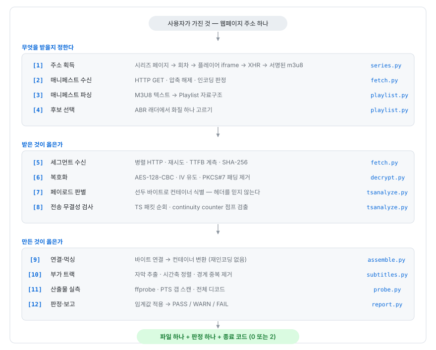

# 스트림에서 파일로

**HLS 재조립·검증 코드로 배우는 컴퓨터 과학과 웹 보안**

> 교재 설계 문서 (제0장). `hlsrecon/` 15개 모듈 4,173 LOC 와 `tests/run.sh` 525 LOC
> 를 전수 독해한 결과에서 도출한 지식 지도와 커리큘럼이다. 이후 각 장은 이 문서의
> 매트릭스를 근거로 집필한다.

---

## 0.1 이 교재가 다루는 문제

한 문장으로 쓰면 이렇다.

> **웹 서버가 조각으로 흘려보내는 영상을, 로컬 디스크의 파일 하나로 되돌릴 수 있는가.
> 되돌렸다면 그것이 원본과 같다는 것을 어떻게 아는가.**

앞 절반은 **재조립(reassembly)** 문제이고 뒤 절반은 **검증(verification)** 문제다. 둘은
난이도가 다르다. 재조립은 명령 한 줄로 끝나는 것처럼 보인다.

```bash
ffmpeg -i master.m3u8 -c copy out.mp4     # 받아진다. 그러나 —
```

이 명령은 중간 세그먼트가 HTTP 404 로 빠져도 **조용히 건너뛰고 종료 코드 0 으로
끝난다.** 출력 파일의 총 재생 길이조차 정상과 같다. 이 저장소의 회귀 테스트가 실측한
값은 다음과 같다.

```
6초 세그먼트 1개 결손 → ffmpeg 종료 코드 0, 출력 길이 30.03s (정상과 동일)
                     → 실제로는 5.99s ~ 12.02s 구간이 통째로 비어 있음
```

**총 길이가 맞는데 중간이 비어 있다.** 이 한 문장이 이 교재 전체의 출발점이다. 왜 이런
일이 가능한지 답하려면 MPEG-TS 의 표시 시각(PTS)이 절대 시각이라는 사실을 알아야
하고(제4부), 그 사실을 알면 "총 길이 비교"라는 검증이 왜 무력한지, 대신 무엇을 봐야
하는지가 따라 나온다.

### 다루는 것

| 영역 | 내용 |
|---|---|
| **네트워크** | HTTP 의 무상태성이 무결성 보증의 부재로 이어지는 경로, 상태 코드의 의미론적 붕괴, 콘텐츠 협상의 부작용, URL 정규화의 멱등성 |
| **자료구조·파싱** | 상태 기계로서의 매니페스트 파서, TLV(Type-Length-Value) 재귀 구조, 자기동기(self-synchronizing) 스트림 |
| **비트 수준 표현** | MPEG-TS 188바이트 패킷 헤더, 4비트 순환 카운터, ISO-BMFF 박스, 90kHz 클럭, 33비트 래핑 |
| **암호** | AES-128-CBC, PKCS#7 패딩, IV 유도 규칙, 키 배포 모델과 Kerckhoffs 원리 |
| **보안** | 접근 통제 우회의 해부, CORS 헤더의 정보 누출, 서명 URL 의 수명, 자격증명의 앰비언트 권한, 난독화의 한계, 콘텐츠 스니핑의 양면성 |
| **분산·시간** | at-least-once 전달과 멱등성, 두 시간축의 아핀 대응, 만료 시각이 만드는 작업 순서 제약 |
| **검증 방법론** | 테스트 오라클 문제, 결함 주입, 대조군 설계, 백분위수 통계, 임계값의 오탐·미탐 균형 |

### 다루지 않는 것

- **DRM 우회.** 이 코드는 `KEYFORMAT=identity` 인 AES-128 만 처리하고 Widevine ·
  FairPlay · PlayReady · SAMPLE-AES 를 코드 레벨에서 거부한다(`playlist.py:62-64`).
  교재는 "AES-128 이 왜 DRM 이 아닌가"를 **암호학적으로 설명**하되, 실제 DRM 의
  키 추출 기법은 다루지 않는다. 그것은 이 저장소에 코드가 없다.
- **영상 코덱 내부.** H.264 의 매크로블록 예측이나 AAC 의 MDCT 는 범위 밖이다.
  이 코드는 재인코딩을 하지 않는다(`-c copy`). 코덱은 불투명한 바이트열로 다룬다.
- **권한 없는 콘텐츠 취득의 정당화.** 접근 통제 메커니즘을 해부하는 목적은
  **그 메커니즘이 어디까지 보증하고 어디부터 보증하지 못하는지**를 아는 것이다.
  방어자 관점과 감사자 관점에서 읽어야 의미가 있다.

---

## 0.2 파이프라인 — 교재의 뼈대

"스트림을 파일로"는 단일 동작이 아니라 12단계 파이프라인이다. 이 저장소의 모듈 경계가
그 단계와 거의 일치하므로, 교재의 장 구성도 이 순서를 따른다.



*그림 0-1 — 스트림을 파일로 되돌리는 12단계 파이프라인*

부수 경로 셋이 이 위에 얹힌다. 교재에서는 각각 독립된 장으로 다룬다.

| 부수 경로 | 모듈 | 주제 |
|---|---|---|
| 이름·보관 구조 | `naming.py` `library.py` | 파일 시스템의 표현 문제 — 유니코드 정규화, 예약 문자, 이식성 |
| 재고 조사 | `inventory.py` | 재실행 시 "이미 있는 것"의 판별 — 구조적 무결성 검사와 판정의 비대칭 비용 |
| 진입점 | `cli.py` | 계층 조립, 실패 진단, 자원 정리(cleanup) 보증 |

---

## 0.3 지식 추출 매트릭스

코드의 각 지점에서 **어떤 CS 개념이 필요했고, 그 지점에 어떤 보안 함의가 있는지**를
전수 조사한 결과다. 앵커는 실제 파일과 줄 번호이며, 교재 본문은 이 앵커를 인용한다.

### 1군 — 전송 계층 (HTTP 의 태생적 한계)

| # | 코드 앵커 | 필요한 지식 | 보안 함의 |
|---|---|---|---|
| T1 | `fetch.py:36-54` `normalize_url` | 퍼센트 인코딩의 **멱등성 부재** — 이미 인코딩된 `%20` 을 다시 인코딩하면 `%2520` 이 되어 다른 자원을 가리킨다. `_PATH_SAFE` 가 `%` 를 보존하는 이유 | **이중 인코딩(double encoding) 우회** — 같은 성질을 공격 측에서 쓰면 경로 검증을 통과하고 다른 경로에 도달한다. 정규화 시점이 검증 시점과 어긋나면 그대로 취약점 |
| T2 | `fetch.py:57-70` `_decompress` | Content-Encoding 협상, gzip/deflate 의 zlib 래퍼 유무 차이, brotli 를 요청하지 않는 이유(표준 라이브러리 부재) | **압축 폭탄(decompression bomb)** — `gzip.decompress` 는 크기 상한이 없다. 이 코드의 미방어 지점 |
| T3 | `fetch.py:155-161` | Range 요청과 압축의 **의미론적 충돌** — 부분 요청에 압축이 걸리면 바이트 범위가 무엇의 범위인지 정의되지 않는다. 그래서 `Accept-Encoding: identity` 강제 | 범위 요청 처리 불일치는 캐시 오염(cache poisoning)의 고전적 원인 |
| T4 | `fetch.py:196-206` | **재시도 정책의 의미론** — 4xx 는 재시도해도 같으므로 즉시 중단, 단 408·429 는 예외. 지수 백오프 `backoff * 2^(n-1)` | 무분별한 재시도는 자기 자신을 향한 증폭 공격이 된다. 429 를 존중하는 것은 규격 준수이자 방어 |
| T5 | `fetch.py:88-92` `allow_origin` | **CORS 의 오용** — `Access-Control-Allow-Origin` 은 "브라우저 JS 가 응답을 읽어도 되는 출처"이지 "서버가 요구하는 Referer"가 아니다 | ★ **정보 누출**. 서버가 403 응답에까지 허용 출처를 실어 보내면, 그 헤더가 곧 "어떤 Referer 를 위조해야 하는지"의 답이 된다. `cli._adopt_origin` 이 이 누출을 그대로 이용한다 |
| T6 | `fetch.py:223-243` `get_many` | 스레드 풀 기반 병렬 수신에서 **결과 순서 보존** — `as_completed` 는 완료 순, 인덱스로 원위치 복원 | 병렬도는 서버 측에서 이상 트래픽으로 보인다. 속도와 탐지 가능성의 교환 |
| T7 | `cli.py:39-54` `_normalize_cookie` | 쿠키 값은 **파싱하지 않는다.** 이름/값으로 쪼갠 뒤 재조립하면 특수문자가 든 쿠키가 훼손된다 | ★ **자격증명의 취급.** 셸 히스토리·`ps` 출력에 평문으로 남는 앰비언트 권한 문제. 헤더 값의 개행은 요청 자체를 거부시키는데, 이는 **HTTP 응답/요청 분할(splitting)** 방어의 잔재 |
| T8 | `report.py:36-46` `_redact_headers` | 로그·아티팩트에서의 **자격증명 편집(redaction)** — 재현성보다 유출 방지를 앞세운 결정 | ★ CI 아티팩트로 남는 JSON 이 곧 계정 접근권이 되는 문제. 편집 대상 목록(`SENSITIVE_HEADERS`)이 완전한가는 별도 논점 |
| T9 | `fetch.py:20-23` `DEFAULT_UA` | User-Agent 기반 콘텐츠 협상의 실재 | ★ **봇 탐지 회피의 경계** — 신원 위장은 기술적으로 사소하고 법적·윤리적으로 사소하지 않다 |

### 2군 — 신뢰의 문제 (자기 신고 메타데이터)

| # | 코드 앵커 | 필요한 지식 | 보안 함의 |
|---|---|---|---|
| M1 | `tsanalyze.py:20-37` `sniff` | **매직 넘버 판별** — TS 는 188바이트 주기의 `0x47`, ISO-BMFF 는 오프셋 4~8 의 박스 타입. 두 번째 패킷까지 확인해 우연 일치를 배제 | ★ 상태 코드 200 과 `Content-Type` 이 **둘 다 정상인데 본문은 오류 페이지**인 경우가 실재한다. 이 코드의 테스트는 서버가 `Content-Type: video/mp2t` 로 응답하면서 본문에 `<!DOCTYPE html>` 을 담는 상황을 재현한다(`tests/run.sh:141-145`) |
| M2 | `subtitles.py:417-429` `_sniff_format` | 같은 원리의 두 번째 적용 — 자막은 **큐 타임코드의 존재**가 유일한 판별 근거 | 콘텐츠 스니핑은 양날이다. 브라우저의 MIME 스니핑은 XSS 벡터였고 그래서 `X-Content-Type-Options: nosniff` 가 생겼다. **언제 스니핑이 옳고 언제 취약점인가**가 이 장의 핵심 질문 |
| M3 | `inventory.py:67-102` `_isobmff_flaw` | 같은 원리의 세 번째 적용 — 박스 경계의 합이 파일 크기와 정확히 맞는지로 **구조적 완결성** 판정. 본문(`mdat`)은 읽지 않으므로 O(박스 수) | 파서 견고성. `box_size == 0`(파일 끝까지) · `== 1`(64비트 largesize) 분기를 빠뜨리면 정상 파일을 손상으로 오판하고, 경계 검사를 빠뜨리면 **정수 오버플로 기반 파서 취약점**이 된다 |
| M4 | `cli.py:57-102` `_diagnose` | 실패의 **관측 가능성** — 무엇이 왔는지(상태·타입·선두 바이트·본문 일부)를 제시하고 원인 후보를 나열 | 오류 메시지의 정보량과 정보 누출은 상충한다. 클라이언트 도구이므로 여기서는 정보량이 이긴다 — 서버였다면 반대 |
| M1′ | `tsanalyze.py:20-37` | ★ **같은 헤더, 정반대 의미** — `200` + `text/html` 이 (a) 위장된 정상 세그먼트와 (b) 토큰 만료 오류 페이지 둘 다를 뜻한다. 헤더가 완전히 같아 선두 바이트만이 유일한 판별 근거 | 판별하지 않는 도구는 오류 페이지를 세그먼트로 저장하고 **"전량 수신 성공"을 보고한다** — 검증 도구가 정반대 결론을 내는 지점 |
| M5 | `tsanalyze.py:20-37` ↔ `X-Content-Type-Options: nosniff` | ★ **스니핑의 양면성** — 브라우저에서 MIME 스니핑은 XSS 벡터였고 그래서 `nosniff` 가 생겼다. 같은 원칙이 이 도구에서는 정확성의 근거다 | 가르는 기준은 **스니핑 결과가 무엇을 결정하는가**다. **실행**을 결정하면 취약점, **분류**를 결정하면 미덕. 보안 원칙의 문맥 의존성을 보여주는 교과서적 사례 |

### 3군 — 컨테이너와 비트 수준 표현

| # | 코드 앵커 | 필요한 지식 | 보안 함의 |
|---|---|---|---|
| C1 | `tsanalyze.py:71-121` `analyze` | MPEG-TS 패킷 헤더 해부 — sync byte, TEI(1비트), PID(13비트), scrambling control(2비트), adaptation field control(2비트), **continuity counter(4비트)** | 스크램블 비트가 0 이 아닌 패킷 = 복호화되지 않은 패킷. 키가 틀렸거나 SAMPLE-AES 라는 신호 |
| C2 | `tsanalyze.py:104-121` | ★ **4비트 순환 카운터의 정보이론적 한계** — 0~15 순환이므로 정확히 16 의 배수만큼 유실되면 검출 불가. 이 검사의 미탐률을 정량화할 수 있다 | 검사기의 한계를 아는 것이 검사기를 쓰는 조건. "PASS = 무결"이 아니라 "PASS = 이 검사로는 못 잡음" |
| C3 | `tsanalyze.py:100-121` | CC 는 **페이로드를 실은 패킷에서만 증가**한다. adaptation-only 패킷은 유지, `cc == prev` 는 규격이 허용한 중복 패킷 | 규격의 예외를 모르면 오탐이 쏟아진다. 정탐률만 보는 검사기는 쓰이지 않는다 |
| C4 | `assemble.py:93-105` `concat_segments` | ★ **자기동기(self-synchronizing) 포맷** — MPEG-TS 는 단순 바이트 연결이 규격상 유효하다. fMP4 는 초기화 세그먼트(`EXT-X-MAP`)를 앞에 두면 같은 성질이 성립 | 포맷의 대수적 성질(연결에 대해 닫혀 있음)이 곧 구현 단순성. 이 성질이 없으면 병합기를 직접 만들어야 한다 |
| C5 | `probe.py:191-233` `gap_scan` | ★ **총 길이로는 결손을 못 잡는 이유** — PTS 는 절대 표시 시각이므로 중간 조각이 사라져도 뒤 조각의 시각이 유지된다. 결손은 총량이 아니라 **타임라인의 구멍**으로 나타난다 | 이 교재의 출발점. 잘못된 관측 지표를 고르면 검증 전체가 무의미해진다 |
| C6 | `probe.py:222-227` | B-프레임 때문에 **패킷 순서 ≠ 표시 순서** → 시각 기준 정렬 필요. 임계값은 프레임 간격 **중앙값의 3배 또는 0.4초 중 큰 값** | 중앙값을 쓰는 이유(이상치 내성), 가변 프레임률에서의 오탐 가능성. 임계값 설계는 오탐·미탐 균형 문제 |
| C7 | `playlist.py:327-329` `EXT-X-BYTERANGE` | 단일 파일 내 바이트 범위 세그먼트. 오프셋 생략 시 **직전 범위의 끝**을 이어받는 상태 의존 파싱 | 상태 의존 파서는 순서가 뒤바뀌면 조용히 틀린다. 파서의 상태 기계를 명시적으로 그려야 하는 이유 |

### 4군 — 암호

| # | 코드 앵커 | 필요한 지식 | 보안 함의 |
|---|---|---|---|
| K1 | `decrypt.py:33-47` | AES-128-CBC 복호화, **IV 유도 규칙** — `EXT-X-KEY` 의 IV 속성이 없으면 해당 세그먼트의 media sequence number 를 128비트 big-endian 으로 채운다 | IV 가 예측 가능하다는 사실 자체가 설계 특성이다. CBC 에서 예측 가능한 IV 가 문제되는 조건(선택 평문 공격)과 여기서 왜 문제가 덜한지 |
| K2 | `decrypt.py:50-58` `_unpad_pkcs7` | PKCS#7 패딩 제거. ★ **패딩이 깨져도 예외를 던지지 않고 원본을 넘긴다** — 손상 검출이 복호화 단계에 묻히지 않게 하기 위한 결정 | ★ **패딩 오라클(padding oracle)** 의 정확한 반대편. 서버였다면 이 동작이 곧 취약점이고, 검증 도구이므로 오히려 옳다. **같은 코드가 역할에 따라 취약점이 되기도, 설계 미덕이 되기도 한다**는 교훈 |
| K3 | `decrypt.py:14-31` `KeyCache` | 키 재사용 캐시. 세그먼트마다 키를 다시 받지 않는다 | 키가 메모리에 평문으로 상주하는 시간. 위협 모델에 따라 논점이 갈린다 |
| K4 | `playlist.py:62-64` `is_supported` | ★ **AES-128 은 DRM 이 아니다** — 평문 16바이트 키를 URI 로 그대로 내려준다. Kerckhoffs 원리 관점에서 이것은 "링크 보호"이지 "콘텐츠 보호"가 아니다 | 위협 모델의 명시가 보안 설계의 시작. **누구로부터 무엇을 지키는가**를 규정하지 않은 보호는 보호가 아니다 |
| K5 | `playlist.py:63` 주석 | SAMPLE-AES 는 프레임 단위 부분 암호화라 세그먼트 통째 복호화가 성립하지 않는다 | 암호화 입자(granularity)가 처리 구조를 결정한다 |

### 5군 — 접근 통제와 그 우회

| # | 코드 앵커 | 필요한 지식 | 보안 함의 |
|---|---|---|---|
| A1 | `cli.py:105-124` `_adopt_origin` | ★ 핫링크 차단의 실제 메커니즘과, **서버가 스스로 흘린 힌트로 그것을 통과하는 경로**. `*` 는 근거가 되지 못하므로 무시 | 교재의 보안 파트 정점. "차단 응답에 우회 정보를 실어 보내는" 구성 오류를 방어자 관점에서 어떻게 고치는가까지 다룬다 |
| A2 | `series.py:1-19` `resolve` | ★ **서명 URL(signed URL)** — `?md5=<서명>&expires=<unix>`. 만료 시각이 박혀 있으므로 27화치 주소를 미리 모아두면 뒤쪽이 반드시 깨진다 → **지연 해석(late resolution)** | 시간 제한 능력(capability)의 설계. HMAC 서명·만료·재생 방지의 삼각형. 만료가 짧을수록 안전하지만 클라이언트 구현이 어려워진다 |
| A3 | `series.py:224-255` `unpack` | packed JS(`eval(function(p,a,c,k,e,d){…})`) 복원. 진법이 36 을 넘으므로 자릿수 표를 직접 둔다. **실행하지 않고 읽기만 한다** | ★ **난독화는 보안이 아니다**(security through obscurity). 동시에 "실행하지 않는다"는 이 코드의 결정은 **신뢰 경계** 설계의 좋은 예 — 원격 코드를 파싱은 하되 평가하지 않는다 |
| A4 | `series.py:99-109` `_from` | 요청 사슬 단계마다 **다른 Referer** — 페이지·iframe·XHR 이 각각 다른 출처에서 열린다. 하나라도 비면 404 | Referer 기반 접근 통제가 왜 약한 방어인지(전적으로 클라이언트 자기 신고), 그럼에도 왜 널리 쓰이는지 |
| A5 | `probe.py:64-69` `-allowed_extensions` | 세그먼트를 `.html` 등으로 위장해 확장자 기반 차단을 피하는 CDN | ★ **확장자 기반 필터링의 무의미함.** 방어자 관점에서 확장자는 통제 지점이 될 수 없다 |
| A5′ | `probe.py:37-51` | FFmpeg 8 의 확장자 방어 **3층 구조**(`allowed_segment_extensions` → `allowed_extensions` → 포맷–확장자 일치)와 각 층의 적용 범위. `.html` 만 기본 허용 목록에 등재돼 있다 | ★ `ALL` 은 **CVE-2023-6602 대응 방어를 끄는 행위**다(HLS 플레이리스트로 임의 demuxer 를 강제 개방). 최소 권한 원칙상 열거가 옳다 |
| A7 | `assemble.py:1-6` ↔ `cli.py:391-402` | ★ **위임의 정책 상속** — ffmpeg 에 위임하면 ffmpeg 의 확장자 정책까지 함께 상속한다. 실측: `.txt` 위장 스트림에서 `segments` 모드는 성공, `remux` 모드는 실패 | `auto` 는 LIVE 이거나 세그먼트 단위 복호화가 불가능할 때만 `remux` 로 내려가므로 **LIVE + 위장 확장자 조합에서만 나타나는 재현 곤란한 실패 경로**가 생긴다 |
| A6 | `tests/gzip_server.py:22-25` | 경로 검증 — `resolve()` 후 `ROOT not in target.parents` 로 탈출 차단 | ★ **경로 순회(path traversal)** 방어의 정석 형태와, 이 구현의 미묘한 허점(심볼릭 링크 · `ROOT == target` 분기) |

### 6군 — 시간·분산 시스템

| # | 코드 앵커 | 필요한 지식 | 보안 함의 |
|---|---|---|---|
| S1 | `subtitles.py:191-218` `timestamp_offset` | ★ **두 시간축의 아핀 대응** — `X-TIMESTAMP-MAP=LOCAL:<자막시각>,MPEGTS:<90kHz>`. 오프셋 = `mpegts/90000 − video_pts0 − local_sec` | 시간 동기화의 기준선이 없으면 검증 자체가 성립하지 않는다 |
| S2 | `subtitles.py:208-210` | **33비트 부호 없는 PTS** — 음수는 무효이므로 매핑 자체를 불신. 래핑(약 26.5시간 주기) | 신뢰할 수 없는 입력의 범위 검사. 이 검사가 없으면 음수 오프셋으로 자막 전체가 밀린다 |
| S3 | `subtitles.py:259-322` `dedupe` | ★ **at-least-once 전달과 멱등성** — HLS 규격은 경계에 걸친 큐를 양쪽 세그먼트에 넣는 것을 허용한다. 6큐가 9큐가 되는 현상. `(시작, 끝, 본문)` 3중키로 중복 제거 | 분산 시스템 일반 원리. **중복 제거 키의 설계**가 정확도를 결정한다 — 이 코드는 헤더 정제를 중복 판정보다 **먼저** 해야 하는 순서 의존성을 명시한다(`subtitles.py:296-300`) |
| S4 | `subtitles.py:194-197` 및 `probe.py:236-255` | ffmpeg 8.1.1 은 **입력 구성과 무관하게** `X-TIMESTAMP-MAP` 을 적용하지 않는다(마스터 입력 실측). "영상 축이 없어서"라는 통념은 제30장 §30.2.4 에서 반증된다 | ★ **위임의 경계를 아는 것.** 라이브러리에 맡긴 부분과 맡길 수 없는 부분을 구분하지 못하면 조용히 틀린 결과가 나온다 |

### 7군 — 표현과 이식성

| # | 코드 앵커 | 필요한 지식 | 보안 함의 |
|---|---|---|---|
| R1 | `naming.py:120-130` `sanitize` | ★ **유니코드 정규화** — macOS 파일 시스템은 한글을 NFD(자모 분리형)로 저장하고 웹에서 온 이름은 NFC(완성형)다. 섞이면 눈에 같은 두 폴더가 생긴다 | ★ **유니코드 정규화 공격** — 정규화 전후로 다른 문자열이 같아지는 성질은 인증 우회(동형 문자, homoglyph)와 필터 우회의 고전적 벡터 |
| R2 | `naming.py:26` `_UNSAFE_RE` | 파일명 예약 문자 — `/`(경로 구분자) `:`(Finder 가 `/` 로 되돌림) 및 Windows 예약 문자. exFAT 외장 디스크에서 실제로 걸린다 | 파일명 주입. 사용자 제어 문자열이 경로가 되는 지점은 언제나 검토 대상 |
| R3 | `naming.py:19-21` `EPISODE_RE` | ★ **부정 후방탐색 `(?<!\d)` 의 필연성** — 이것이 없으면 `Sky.Blue.2003` 이 줄기 `Sky.Blue.2` + 화수 `003` 으로 갈린다 | 정규식의 정확도가 곧 오분류율. 파일 하나가 엉뚱한 폴더로 가는 정도지만, 같은 실수가 인증 경로에 있으면 취약점 |
| R4 | `report.py:27-30` `_pad` | **동아시아 문자 폭(East Asian Width)** — 한글은 터미널에서 2칸을 차지하므로 문자 수가 아니라 표시 폭으로 채워야 정렬된다 | 렌더링 폭 계산의 불일치는 로그 위조(log forging)의 성분이 되기도 한다 |

### 8군 — 검증 방법론

| # | 코드 앵커 | 필요한 지식 | 보안 함의 |
|---|---|---|---|
| V1 | `tests/run.sh:5-7` | ★ **테스트 오라클 문제** — "검증 도구가 PASS 만 낸다면 아무것도 검증하지 못하는 것과 같다" | 보안 스캐너·정적 분석기에 그대로 적용되는 문제. 도구의 정탐률을 모르면 그 도구의 PASS 는 정보가 아니다 |
| V2 | `tests/run.sh:129-147` | **결함 주입(fault injection)** 8종 — 패킷 12개 제거 · 세그먼트 중복 · 404 · 200+HTML · 타임스탬프 60초 어긋남 · 잘린 MP4 · 0바이트 · 자막 결손 | 각 주입이 어떤 검사를 겨냥하는지의 대응표가 곧 커버리지 증명 |
| V3 | `tests/run.sh:512-522` | ★ **대조군 설계** — "ffmpeg 단독은 같은 결손에 exit 0 를 낸다"는 사실 자체를 테스트로 고정 | 도구의 존재 이유를 회귀 테스트로 못박는 방법. 비교 대상이 개선되면 테스트가 알려준다 |
| V4 | `tests/run.sh:341-344` `inventory` | ★ **양방향 고정** — 너무 관대하면 깨진 파일이 완성본 행세를 해 회차가 영원히 빠지고, 너무 엄격하면 멀쩡한 27화를 매번 다시 받는다. **오탐과 미탐을 둘 다 테스트한다** | 분류기 평가의 기본. 정탐만 고정한 테스트는 "항상 FAIL 을 내는 구현"을 통과시킨다 |
| V5 | `report.py:56-62` `_quantile` | **백분위수 통계** — TTFB 는 평균이 아니라 p50·p95 로 본다 | 꼬리 지연(tail latency)이 실제 실패를 만든다. 평균은 이상치를 감춘다 |
| V6 | `report.py:424-430` | ★ **기준선이 성립하지 않으면 판정하지 않는다** — `--limit` 표본 실행에서는 영상만 잘리고 자막은 온전하므로 "판정 보류"를 낸다 | 알 수 없음(unknown)과 통과(pass)를 구별하는 것. 이 구별이 없는 도구는 신뢰할 수 없다 |
| V7 | `tests/run.sh:500-502` | ★ **기준선 오염** — 자막을 컨테이너에 내장하면 전체 duration 이 자막 끝까지 늘어나므로, 실측을 기준으로 삼으면 밀린 자막이 스스로 기준을 끌고 가 검사가 **항상 통과**한다. 그래서 기준선은 플레이리스트 선언 길이 | ★ 자기 참조 검증의 함정. 측정 대상이 측정 기준에 영향을 주면 그 검증은 무효다 |

---

## 0.4 커리큘럼

각 장은 **문제 → 원리 → 코드 → 일반화 → 보안** 5단으로 쓴다.
"코드"는 이 저장소의 실제 앵커이고, "일반화"는 그 원리가 이 도메인 밖에서 어디에
나타나는지, "보안"은 같은 지점의 공격·방어 관점이다.

### 제1부 — 문제의 성립

| 장 | 제목 | 주 앵커 | 핵심 질문 |
|---|---|---|---|
| 1 | [스트림과 파일 — 두 존재론](01-stream-vs-file.md) | README:15-34 | 왜 "받아졌다"가 "옳게 받아졌다"가 아닌가 |
| 2 | [HTTP 위에서 스트리밍을 흉내내기 — ABR 과 HLS 의 발명](02-abr-and-hls.md) | `playlist.py` 전반 | 왜 영상을 조각내고 텍스트 목록으로 가리키는가 |
| 3 | [RFC 8216 의 2계층 간접 참조](03-two-tier-indirection.md) | `playlist.py:185-204`, `cli.py:172-196` | 마스터/미디어 분리가 만드는 것과 잃는 것 |

### 제2부 — 전송: HTTP 의 태생적 한계

| 장 | 제목 | 주 앵커 | 핵심 질문 |
|---|---|---|---|
| 4 | [무상태성과 무결성 보증의 부재](04-statelessness.md) | `fetch.py:107-215` | HTTP 는 무엇을 보증하고 무엇을 보증하지 않는가 |
| 5 | [상태 코드의 의미론적 붕괴 — 200 은 성공이 아니다](05-status-code-collapse.md) | `tsanalyze.py:20-37`, `cli.py:459-464` | 자기 신고 메타데이터를 어디까지 믿는가 |
| 6 | [콘텐츠 협상의 부작용 — 압축, 범위, 그리고 충돌](06-content-negotiation.md) | `fetch.py:57-70,155-161` | 두 협상 기능이 겹칠 때 무엇이 정의되지 않는가 |
| 7 | [URL 정규화와 멱등성 — `%20` 과 `%2520`](07-url-normalization.md) | `fetch.py:36-54`, `playlist.py:30-38` | 변환은 왜 경계에서 한 번만 해야 하는가 |
| 8 | [병렬성·재시도·계측 — 관측하는 다운로더](08-parallel-retry-measure.md) | `fetch.py:196-243`, `report.py:183-230` | 무엇을 재시도하고 무엇을 포기하는가. TTFB p95 를 보는 이유 |

### 제3부 — 접근 통제와 그 한계 ★보안 중핵

| 장 | 제목 | 주 앵커 | 핵심 질문 |
|---|---|---|---|
| 9 | [핫링크 차단의 해부 — Referer 라는 자기 신고](09-hotlink-referer.md) | `series.py:99-109`, `cli.py:105-124` | 클라이언트가 보내는 값으로 접근을 통제할 수 있는가 |
| 10 | [CORS 헤더가 흘리는 것 — ACAO 의 오독과 정보 누출](10-cors-leak.md) | `fetch.py:90-92`, `cli.py:105-124` | 차단 응답이 우회 방법을 알려주는 구성은 어떻게 생기는가 |
| 11 | [서명 URL — 시간 제한 능력의 설계](11-signed-url.md) | `series.py:1-19,266-300` | 만료가 만드는 구현 제약(지연 해석)과 재생 방지 |
| 12 | [자격증명의 앰비언트 권한 — 쿠키, 프로세스 목록, 아티팩트](12-ambient-credentials.md) | `cli.py:39-54`, `report.py:33-53` | 자격증명은 어디에 남는가. 편집(redaction) 대상은 완전한가 |
| 13 | [난독화는 보안이 아니다 — packed JS 와 신뢰 경계](13-obfuscation-not-security.md) | `series.py:224-255` | 원격 코드를 파싱하되 실행하지 않는다는 결정 |
| 14 | [세그먼트 확장자 위장 — 이름·선언·내용이 갈라질 때](14-segment-masquerading.md) | `probe.py:64-80`, `README.md:242-253` | `.html` 은 왜 HTML 이 아닌가. 규격의 빈틈은 어디인가 |
| 15 | [회피가 방어를 끄게 만들 때 — CVE-2023-6602 와 `allowed_extensions ALL`, 그리고 측정되지 않은 개선](15-evasion-disables-defense.md) | `probe.py:37-52`, `assemble.py:1-6` | 한쪽의 필터 회피가 다른 쪽의 보안 방어를 끄도록 강요하는 구조 |
| 16 | [콘텐츠 스니핑의 양면 — 언제 미덕이고 언제 취약점인가](16-sniffing-two-faces.md) | `tsanalyze.py:20-37`, `subtitles.py:417-429` | `X-Content-Type-Options: nosniff` 가 생긴 이유와 이 코드가 반대로 가는 이유 |

> 제14·15장은 선행 조사 [`research-01-segment-masquerading.md`](research-01-segment-masquerading.md)
> 에서 도출했고, 두 장을 **가장 먼저 집필해 이후 장의 형식 견본**으로 삼았다. 조사
> 문서의 §4 재현 실험이 제14장의 실습 절로 들어갔다(외부 사이트 없이 로컬 재현).
> 제3부가 16장까지로 늘어나면서 이후 장 번호가 1씩 밀렸다(전체 **39장**).
>
> **집필 중 코드 변경 2건 발생.**
>
> 1. `probe.py`(변경 전 48행) 의 `-allowed_extensions ALL` 을 열거 상수
>    `ALLOWED_SEGMENT_EXTS` 로 교체. 회귀 테스트 62/62 통과, 기능 회귀 없음. 다만
>    **공격면 축소는 측정되지 않았고**, 그 사실 자체가 제15장 §15.6("우연한 방어")의
>    소재가 되었다. 앵커 `A5`·`A5′` 는 변경 후 코드를 가리킨다.
> 2. `assemble.py:18-26` 의 주석 교체. "ADTS 를 바꿔주지 않으면 mp4 먹싱이
>    실패한다"는 서술이 **ffmpeg 8.1.1 실측과 어긋난다**(먹서가 필터를 자동 삽입한다).
>    인자는 그대로 두고 주석만 실측에 맞췄다. 경위는 제30장 §30.3.3.
>
> 둘 다 같은 모양이다 — **이득이 측정되지 않는 인자를, 수임자 구현에 기대지 않기
> 위해 남기고 그 사실을 코드에 적었다.**

### 제4부 — 비트 수준: 컨테이너와 무결성

| 장 | 제목 | 주 앵커 | 핵심 질문 |
|---|---|---|---|
| 17 | [MPEG-TS 패킷 해부 — 188바이트의 구조](17-mpegts-packet.md) | `tsanalyze.py:71-121` | 헤더 4바이트에 무엇이 들어 있는가 |
| 18 | [4비트 순환 카운터의 한계 — 검사기의 미탐률](18-cc-counter-limits.md) | `tsanalyze.py:104-121` | 이 검사가 못 잡는 결손은 무엇인가 |
| 19 | [자기동기 포맷과 연결의 대수](19-self-synchronizing.md) | `assemble.py:93-105` | 왜 바이트를 그냥 이어붙여도 되는가 |
| 20 | [ISO-BMFF: 재귀 TLV 구조와 구조적 완결성 검사](20-isobmff-structural.md) | `inventory.py:67-102` | 본문을 읽지 않고 온전함을 판정하는 법 |
| 21 | [PTS 와 90kHz — 왜 총 길이로는 결손을 못 잡는가](21-pts-and-90khz.md) | `probe.py:191-233` | 절대 시각이 만드는 관측의 함정 |
| 22 | [임계값 설계 — 중앙값의 3배, 그리고 오탐](22-threshold-design.md) | `probe.py:224-233` | 가변 프레임률에서 무엇이 깨지는가 |

### 제5부 — 암호: 보호와 보호처럼 보이는 것

| 장 | 제목 | 주 앵커 | 핵심 질문 |
|---|---|---|---|
| 23 | [AES-128-CBC 와 IV 유도 규칙](23-aes-cbc-iv.md) | `decrypt.py:33-47` | media sequence 를 IV 로 쓴다는 것의 의미 |
| 24 | [패딩 오라클의 반대편 — 왜 여기서는 예외를 던지지 않는가](24-padding-oracle-inverse.md) | `decrypt.py:50-58` | 같은 코드가 역할에 따라 취약점이 되는 조건 |
| 25 | [AES-128 은 DRM 이 아니다 — 위협 모델과 Kerckhoffs 원리](25-aes128-is-not-drm.md) | `playlist.py:57-64` | 누구로부터 무엇을 지키는가를 정하지 않은 보호 |
| 26 | [암호화 입자가 구조를 결정한다 — SAMPLE-AES 가 거부되는 이유](26-encryption-granularity.md) | `playlist.py:63`, `cli.py:391-402` | 부분 암호화가 왜 세그먼트 처리를 불가능하게 하는가 |

### 제6부 — 시간과 분산

| 장 | 제목 | 주 앵커 | 핵심 질문 |
|---|---|---|---|
| 27 | [두 시간축의 아핀 대응 — X-TIMESTAMP-MAP](27-affine-time-mapping.md) | `subtitles.py:184-218` | 자막 시각과 영상 클럭을 잇는 식의 유도 |
| 28 | [33비트 래핑과 신뢰할 수 없는 입력](28-33bit-wrap.md) | `subtitles.py:208-210` | 범위 검사가 없으면 무엇이 무너지는가 |
| 29 | [at-least-once 와 멱등성 — 경계 중복 큐](29-at-least-once-idempotency.md) | `subtitles.py:259-322` | 중복 제거 키를 무엇으로 잡는가, 왜 순서가 중요한가 |
| 30 | [위임의 경계 — 라이브러리가 하지 않는 일을 아는 것](30-delegation-boundary.md) | `subtitles.py:194-197`, `probe.py:236-255` | ffmpeg 에 맡길 것과 맡길 수 없는 것 |

### 제7부 — 표현과 이식성

| 장 | 제목 | 주 앵커 | 핵심 질문 |
|---|---|---|---|
| 31 | [유니코드 정규화 — NFC/NFD 와 정규화 공격](31-unicode-normalization.md) | `naming.py:120-130`, `inventory.py:205-211` | 눈에 같은 두 문자열이 다를 때 |
| 32 | [파일명이라는 인터페이스 — 예약 문자와 이식성](32-filename-interface.md) | `naming.py:26`, `library.py` | 사용자 문자열이 경로가 되는 지점 |
| 33 | [정규식의 정확도가 곧 오분류율](33-regex-accuracy.md) | `naming.py:19-21` | `(?<!\d)` 하나가 막는 것 |

### 제8부 — 검증 방법론 ★방법론 중핵

| 장 | 제목 | 주 앵커 | 핵심 질문 |
|---|---|---|---|
| 34 | [테스트 오라클 문제 — 검증기를 검증하기](34-oracle-problem.md) | `tests/run.sh:1-8` | PASS 만 내는 도구와 무검증의 차이 |
| 35 | [결함 주입 설계 — 8종의 대응표](35-fault-injection.md) | `tests/run.sh:129-147` | 어떤 결함이 어떤 검사를 겨냥하는가 |
| 36 | [대조군 — "ffmpeg 은 놓친다"를 테스트로 고정하기](36-control-group.md) | `tests/run.sh:512-522` | 도구의 존재 이유를 회귀로 못박는 법 |
| 37 | [양방향 고정 — 오탐과 미탐을 함께 테스트한다](37-bidirectional-fixing.md) | `tests/run.sh:341-417` | 정탐만 보는 테스트가 통과시키는 잘못된 구현 |
| 38 | [기준선 오염과 판정 보류](38-baseline-contamination.md) | `report.py:424-430`, `tests/run.sh:500-502` | 알 수 없음과 통과를 구별하기 |
| 39 | [판정의 종합 — 임계값에서 종료 코드까지](39-verdict-synthesis.md) | `report.py:123-511`, `cli.py:651-652` | 계측치를 결정으로 바꾸는 규칙 |

### 부록

| 부록 | 제목 | 내용 |
|---|---|---|
| A | [실습 환경 구축](appendix-A-lab-setup.md) | `tests/run.sh` 로 로컬 HLS 스트림 5종을 만드는 법. 외부 서버 없이 전 과정 재현 |
| B | [규격 원문 대조표](appendix-B-spec-crossref.md) | RFC 8216 조항 ↔ 코드 위치 ↔ 교재 장 |
| C | [용어집](appendix-C-glossary.md) | 첫 등장 정의를 모은 것 |
| D | [이 코드의 알려진 한계](appendix-D-known-limits.md) | README:409-441 을 학술적으로 재정리 — 각 한계가 어느 원리에서 오는가 |

---

## 0.5 집필 규약

1. **용어는 공식 표기로, 첫 등장에 한 줄 정의를 붙인다.**
   비유로 대체하지 않는다. `continuity counter`(연속성 카운터 — TS 패킷 헤더의
   4비트 필드, PID 별로 0~15 를 순환한다) 형태.
2. **주장에는 코드 앵커를 단다.** `file.py:line` 형식으로, 검증 가능해야 한다.
3. **"이렇게 하면 된다"보다 "이렇게 하지 않으면 무엇이 깨지는가"를 쓴다.**
   이 저장소의 주석이 이미 그 형식이고, 그것이 이 코드가 교재로 쓸 만한 이유다.
4. **보안 절은 방어자 관점을 반드시 포함한다.** 우회 경로만 설명하고 끝내지 않는다.
5. **한계를 정직하게 쓴다.** 이 코드가 못 하는 것, 이 검사가 못 잡는 것을 명시한다.

---

## 0.6 이 코드가 교재로 적합한 이유

일반적인 오픈소스는 "무엇을 하는가"만 남기고 "왜 그렇게 했는가"는 커밋 메시지와
이슈 트래커로 흩어진다. 이 저장소는 반대다. 주석의 대부분이 **실측으로 확인한 실패와
그 대응의 기록**이다. 몇 가지 예를 든다.

```python
# fetch.py:30-31
# URL 각 부분에서 그대로 두어도 되는 문자. `%` 를 남기는 것이 핵심이다 — 이미
# 인코딩된 주소를 다시 인코딩하면 `%20` 이 `%2520` 이 되어 다른 주소가 된다.
```

```python
# decrypt.py:54-55
# 패딩이 깨졌으면(잘린 세그먼트 등) 자르지 않고 원본을 넘긴다.
# 여기서 예외를 던지면 손상 검출이 복호화 단계에 묻혀버린다.
```

```python
# naming.py:16-17
# `(?<!\d)` 가 핵심이다. 이것이 없으면 `Sky.Blue.2003` 이 줄기 `Sky.Blue.2` + 화수
# `003` 으로 갈린다 — 연도를 화수로 오인해 영화 한 편이 엉뚱한 시리즈명을 얻는다.
```

세 주석 모두 **반례를 제시한다.** 교재의 "이렇게 하지 않으면 무엇이 깨지는가" 절이
이미 코드 안에 초안 형태로 존재한다는 뜻이다. 교재의 일은 그 초안에 원리의 이름을
붙이고, 그 원리가 이 도메인 밖 어디에 나타나는지를 잇는 것이다.
