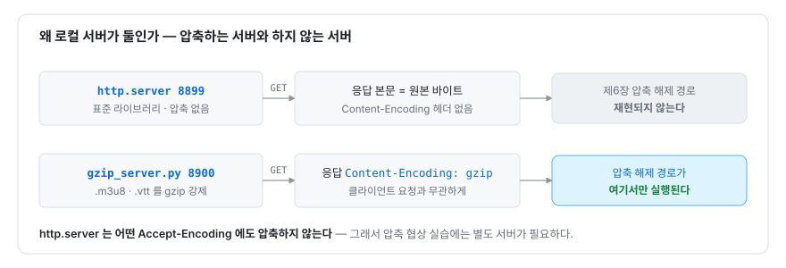

# 부록 A — 실습 환경 구축

**외부 사이트 없이 이 교재의 모든 실습을 재현한다**

> 이 부록은 참조용이다. 순서대로 읽어도 되고, 필요한 항목만 찾아 써도 된다.
> 이 교재의 실습은 전부 로컬에서 닫힌다 — 인터넷도, 특정 스트리밍 서비스도 필요 없다.
> `ffmpeg` 와 `python3` 만으로 평문 TS·AES-128·fMP4·멀티 variant·자막 트랙을 직접
> 만들고, 로컬 HTTP 서버로 흘려보내고, 결함을 주입해 검증 도구가 실제로 잡는지 확인한다.
> 모든 명령은 복사해 바로 쓸 수 있게 적었다.

이 부록의 지도:

| 절 | 내용 | 언제 보나 |
|---|---|---|
| A.1 | 필요한 도구와 버전 | 시작 전 한 번 |
| A.2 | 한 번에 전부 — `tests/run.sh` | 일단 돌려 보고 싶을 때 |
| A.3 | 스트림 5종을 손으로 만들기 | 각 스트림이 어떻게 생기는지 알고 싶을 때 |
| A.4 | 로컬 서버 둘 — 왜 `gzip_server.py` 가 따로 필요한가 | 제6장 압축 실습 전 |
| A.5 | 결함 주입본 만들기 — 제35장 8종 | 제8부 검증 실습 전 |
| A.6 | 위장 스트림 만들기 — 제14장 §14.5 통합 | 제14·15장 실습 전 |
| A.7 | 실행과 확인 | 도구를 스트림에 물릴 때 |
| A.8 | 흔한 문제와 해결 | 막혔을 때 |
| A.9 | 이 부록의 한계 | 수치를 인용하기 전에 |

---

## A.1 필요한 도구와 버전

| 도구 | 버전 | 쓰이는 곳 | 없으면 |
|---|---|---|---|
| `python3` | 3.10 이상 | 도구 본체·자산 생성·로컬 서버 | 실행 자체가 안 된다 (`pyproject.toml:10`) |
| `ffmpeg` / `ffprobe` | 8 계열 권장 | 스트림 생성·재조립·실측 | 재조립과 검증이 불가능 |
| `cryptography` | 최신 | AES-128 세그먼트 복호화 | AES 스트림에서 `ModuleNotFoundError` (`pyproject.toml:23-25`) |

`tests/run.sh` 는 시작 시점에 세 도구의 존재를 직접 확인하고, 하나라도 없으면 그 자리에서 멈춘다.

```bash
# tests/run.sh:21-23
for tool in ffmpeg ffprobe python3; do
  command -v "$tool" >/dev/null || { echo "필수 도구 없음: $tool"; exit 1; }
done
```

버전 확인:

```bash
python3 --version          # Python 3.10 이상
ffmpeg  -version | head -1  # ffmpeg version 8.x …
ffprobe -version | head -1
```

> **버전이 왜 중요한가.** 제14·15장의 확장자 방어 실측은 **FFmpeg 8.1.1** 에서 얻은
> 것이다. `.html` 이 세그먼트 허용 목록 기본값에 들어간 것도, 확장자 방어가 3층으로
> 갈라지는 것도 FFmpeg 8 계열의 동작이다. 그 이전 빌드에서는 결과가 다를 수 있다 —
> 제15장 §15.10 이 "③층이 없는 빌드에서 검증하지 못했다"고 밝혀 둔 그 지점이다.
> 이 저장소는 ffmpeg 버전을 고정하지 않으므로(`README.md:36-51`), 버전에 따라 갈리는
> 실습은 자신의 `ffmpeg -version` 을 먼저 확인하고 읽는다.

설치는 저장소 루트에서 한 번에 끝난다.

```bash
# README.md:39-42
# 요구사항: python 3.10+, ffmpeg/ffprobe (PATH 에 있어야 한다)
brew install ffmpeg

pip install .        # hls-recon 명령이 설치된다 (cryptography 는 함께 딸려온다)
```

설치하지 않고 저장소에서 바로 쓰려면 `./hls-recon` 이 실행 파일이다(`README.md:45-46`).
이 부록의 예시는 모두 이 `./hls-recon` 형태를 쓴다.

---

## A.2 한 번에 전부 — `tests/run.sh`

무엇이 어떻게 만들어지는지 신경 쓰기 전에, 일단 전 과정을 한 번 돌려 보는 것이 빠르다.

```bash
cd /path/to/hls-recon
./tests/run.sh
```

이 스크립트 하나가 스트림 생성 → 결함 주입 → 로컬 서버 기동 → 정상 케이스 검증 →
결함 검출 → 대조군 확인까지 전부 수행하고, 통과/실패 개수를 마지막에 찍는다.

자산이 어디에 놓이는지부터 알아야 한다.

```bash
# tests/run.sh:12
WORK="${TMPDIR:-/tmp}/hls-recon-tests"
```

`run.sh` 는 실행할 때마다 이 디렉터리를 **통째로 지우고 다시 만든다**(`rm -rf "$WORK"`,
`tests/run.sh:34`). 즉 자산은 실행 사이에 보존되지 않는다. 한 번 실행하면 그 안에
스트림이 남아 있으므로, 스크립트가 끝난 뒤 그 디렉터리로 들어가 직접 살펴볼 수 있다.

```bash
cd "${TMPDIR:-/tmp}/hls-recon-tests"
ls        # plain enc fmp4 multi subko suben subbad damaged … 이 보인다
```

한 가지 주의: `run.sh` 는 종료할 때 자신이 띄운 서버를 정리한다(`trap cleanup EXIT`,
`tests/run.sh:25-30`). 자산은 남지만 **서버는 죽는다.** 그러므로 스크립트가 끝난 뒤
그 자산을 직접 재생·검증하려면 서버를 다시 띄워야 한다(→ A.4).

포트를 바꾸려면 환경 변수로 넘긴다.

```bash
PORT=9100 ./tests/run.sh      # 기본 8899, gzip 서버는 그 +1 (tests/run.sh:13,152)
```

`run.sh` 가 만드는 것을 한눈에:

| 디렉터리 | 스트림 | 만드는 절 |
|---|---|---|
| `plain/` | 평문 MPEG-TS | A.3.1 |
| `enc/` | AES-128 암호화 TS | A.3.2 |
| `fmp4/` | fMP4 (CMAF) | A.3.3 |
| `multi/` | 멀티 variant (마스터 플레이리스트) | A.3.4 |
| `subko/` `suben/` `subbad/` | 자막 트랙 (한국어·영어·어긋난 것) | A.3.5 |
| `damaged/` | 결함 주입본 4종 | A.5 |
| `stock/` `fill/` | 재고 조사·자막 메우기용 결함 자산 | A.5 |

이후 절들은 각 스트림이 **어떤 ffmpeg 명령으로** 생기는지를 `run.sh` 의 실제 줄과 함께
푼다. 스크립트를 읽지 않고도 각 스트림을 따로 만들 수 있게, 절마다 자족적인 최소 명령을
같이 둔다.

---

## A.3 스트림 5종을 손으로 만들기

### A.3.0 공통 소스 — `source.mp4`

다섯 스트림은 전부 하나의 소스에서 나온다. `ffmpeg` 의 `lavfi`(libavfilter 가상 입력)로
30초짜리 테스트 패턴 영상과 440Hz 사인파 오디오를 합성한다 — 파일도 카메라도 필요 없다.

```bash
# tests/run.sh:37-41
ffmpeg -v error -y \
  -f lavfi -i "testsrc2=size=640x360:rate=30:duration=30" \
  -f lavfi -i "sine=frequency=440:duration=30" \
  -c:v libx264 -preset ultrafast -g 60 -keyint_min 60 -sc_threshold 0 -pix_fmt yuv420p \
  -c:a aac -b:a 128k source.mp4
```

핵심 플래그의 뜻:

| 플래그 | 뜻 | 왜 이 값인가 |
|---|---|---|
| `-g 60 -keyint_min 60` | GOP 길이 60프레임 = 2초마다 키프레임 고정 | 6초 세그먼트 경계가 항상 키프레임에 떨어져 `-c copy` 분할이 깔끔하다 |
| `-sc_threshold 0` | 장면 전환 키프레임 삽입 끄기 | 키프레임 간격을 예측 가능하게 고정한다 |
| `-preset ultrafast` | 인코딩 속도 최우선 | 실습 자산이라 화질보다 생성 속도가 중요 |

> **용어** — **GOP(Group of Pictures, 영상 그룹)**: 하나의 키프레임(독립 복호화 가능한
> 프레임)과 그에 이어지는 예측 프레임들의 묶음. HLS 세그먼트 경계는 키프레임에서
> 끊어야 각 세그먼트가 독립 재생되므로, GOP 길이가 세그먼트 분할의 전제가 된다.

이후 모든 명령은 `source.mp4` 가 있는 디렉터리에서 실행한다고 가정한다.

### A.3.1 평문 TS

가장 단순한 스트림. `-c copy` 로 재인코딩 없이 컨테이너만 바꿔 6초 단위 MPEG-TS
세그먼트로 자른다.

```bash
# tests/run.sh:43-44
ffmpeg -v error -y -i source.mp4 -c copy -f hls -hls_time 6 -hls_playlist_type vod \
  -hls_segment_filename "plain/seg%03d.ts" plain/index.m3u8
```

`plain/index.m3u8` 과 `plain/seg000.ts … seg004.ts` 가 생긴다. 이 스트림이 제17장
(MPEG-TS 패킷 해부)·제18장(연속성 카운터)·제19장(자기동기 포맷과 연결)의 실습 대상이다.
`-c copy` 라 코덱은 손대지 않으며, 세그먼트는 그냥 이어붙여도 유효한 TS 가 된다는
성질(제19장)을 여기서 눈으로 확인할 수 있다.

```bash
cat plain/seg00*.ts > joined.ts        # 단순 연결이 유효한 TS 다 (제19장)
ffprobe -v error -show_format joined.ts
```

### A.3.2 AES-128 암호화 TS

암호화 스트림은 키 파일과 **키 정보 파일(key info file)** 이 먼저 필요하다.

```bash
# tests/run.sh:46-49
head -c 16 /dev/urandom > enc/enc.key
printf '%s/enc/enc.key\n%s/enc/enc.key\n' "$BASE" "$WORK" > enc/keyinfo
ffmpeg -v error -y -i source.mp4 -c copy -f hls -hls_time 6 -hls_playlist_type vod \
  -hls_key_info_file enc/keyinfo -hls_segment_filename "enc/seg%03d.ts" enc/index.m3u8
```

키 정보 파일은 줄 세 개까지의 규약이다.

| 줄 | 값 | 역할 |
|---|---|---|
| 1 | 키 URI | 플레이리스트의 `EXT-X-KEY` 에 그대로 박힌다 — 클라이언트가 키를 받으러 갈 주소 |
| 2 | 키 파일 경로 | ffmpeg 가 **암호화할 때** 읽는 로컬 파일 |
| 3 (생략됨) | IV(16진) | 없으면 IV 를 플레이리스트에 쓰지 않는다 |

`run.sh:47` 은 셋째 줄을 비운다. IV 속성이 없으면 클라이언트는 해당 세그먼트의
**media sequence number 를 128비트 big-endian 으로 채워 IV 로 삼는다** — 이 저장소의
복호화 코드가 그 규칙을 그대로 구현한다(`decrypt.py:33-47`, 제23장). 즉 이 명령은
제23장의 "IV 유도 규칙" 실습을 위한 스트림이다.

`$BASE` 는 로컬 서버 주소(`http://127.0.0.1:8899`), `$WORK` 는 A.2 의 작업 디렉터리다.
손으로 만들 때는 실제 값으로 바꿔 넣는다.

```bash
head -c 16 /dev/urandom > enc/enc.key
printf 'http://127.0.0.1:8899/enc/enc.key\n%s/enc/enc.key\n' "$PWD" > enc/keyinfo
ffmpeg -v error -y -i source.mp4 -c copy -f hls -hls_time 6 -hls_playlist_type vod \
  -hls_key_info_file enc/keyinfo -hls_segment_filename "enc/seg%03d.ts" enc/index.m3u8
```

> 키가 평문 16바이트로 URI 를 통해 그대로 내려간다는 점이 이 스트림의 핵심이다.
> 이것은 "링크 보호"이지 DRM 이 아니다 — 왜 그런지는 제25장(AES-128 은 DRM 이 아니다)
> 에서 위협 모델로 다룬다.

### A.3.3 fMP4 (CMAF)

MPEG-TS 대신 fragmented MP4 세그먼트로 자른다. TS 와 달리 **초기화 세그먼트**(`init.mp4`)가
따로 나오고, 각 미디어 세그먼트는 `.m4s` 다.

```bash
# tests/run.sh:51-53
ffmpeg -v error -y -i source.mp4 -c copy -f hls -hls_time 6 -hls_playlist_type vod \
  -hls_segment_type fmp4 -hls_fmp4_init_filename "init.mp4" \
  -hls_segment_filename "fmp4/seg%03d.m4s" fmp4/index.m3u8
```

플레이리스트에는 `EXT-X-MAP:URI="init.mp4"` 가 들어간다. 초기화 세그먼트를 앞에 두면
`.m4s` 조각들도 단순 연결로 유효한 파일이 된다는 성질(제19장 §19.4)과, 박스 경계의
합으로 온전함을 판정하는 ISO-BMFF 구조 검사(제20장)의 실습 대상이다.

### A.3.4 멀티 variant (마스터 플레이리스트)

화질이 둘인 스트림. 저화질(180p) 렌디션을 하나 만들고, 평문 TS 를 고화질로 재사용한 뒤,
마스터 플레이리스트를 손으로 써서 둘을 묶는다.

```bash
# tests/run.sh:55-66
ffmpeg -v error -y -i source.mp4 -filter_complex "[0:v]scale=320:180[v0]" \
  -map "[v0]" -map 0:a -c:v libx264 -preset ultrafast -b:v 400k -c:a aac -b:a 64k \
  -f hls -hls_time 6 -hls_playlist_type vod -hls_segment_filename "multi/low%03d.ts" multi/low.m3u8
cp plain/*.ts multi/; cp plain/index.m3u8 multi/high.m3u8
cat > multi/master.m3u8 <<'EOF'
#EXTM3U
#EXT-X-VERSION:3
#EXT-X-STREAM-INF:PROGRAM-ID=1,BANDWIDTH=1400000,RESOLUTION=640x360,NAME="360p",CODECS="avc1.42c01e,mp4a.40.2"
high.m3u8
#EXT-X-STREAM-INF:PROGRAM-ID=1,BANDWIDTH=480000,RESOLUTION=320x180,NAME="180p",CODECS="avc1.42c00f,mp4a.40.2"
low.m3u8
EOF
```

`master.m3u8` 은 미디어를 직접 담지 않고 두 미디어 플레이리스트(`high.m3u8`·`low.m3u8`)를
가리킨다 — 이 2계층 간접 참조가 제3장의 주제다. 화질 선택 실습은 `--height` 로 한다.

```bash
./hls-recon "http://127.0.0.1:8899/multi/master.m3u8" -o multi.mkv --height 180
```

### A.3.5 자막 트랙

자막 세그먼트는 ffmpeg 로 만들 수 없다. `run.sh` 의 주석이 그 이유를 적어 둔다.

```bash
# tests/run.sh:69-71
# 자막 트랙. ffmpeg 의 HLS muxer 는 WebVTT 를 세그먼트화하지 못하므로,
# 실제 CDN 이 내보내는 형태 그대로 직접 만든다. 걸치는 큐를 양쪽 조각에 넣는
# 것까지 재현해야 경계 중복 제거가 실제로 검증된다.
```

그래서 자막 세그먼트는 파이썬으로 직접 생성한다(`tests/run.sh:72-127`). 이 생성기가
재현하는 두 가지가 뒤 장들의 실습 대상이다.

- **`X-TIMESTAMP-MAP`** — 자막의 로컬 시각과 영상의 90kHz MPEG-TS 클럭을 잇는 헤더.
  `run.sh:101` 이 각 세그먼트 본문 첫머리에 넣는다. 제27장(두 시간축의 아핀 대응)의 소재다.
- **경계에 걸친 큐의 양쪽 삽입** — `run.sh:103` 이 `if e > lo and s < hi` 로 세그먼트
  경계를 넘는 큐를 양쪽 조각에 넣는다. 6큐가 9큐로 부푸는 이 현상이 제29장
  (at-least-once 와 멱등성)의 중복 제거 실습 대상이다.

`X-TIMESTAMP-MAP` 의 기준값을 영상의 첫 PTS 로 잡는 부분이 이 생성기의 핵심이다.

```python
# tests/run.sh:75-78 (자산 생성 파이썬 블록에서)
raw = subprocess.run(
    ["ffprobe", "-v", "error", "-select_streams", "v:0", "-show_entries", "packet=pts_time",
     "-of", "csv=p=0", "plain/seg000.ts"], capture_output=True, text=True).stdout.split()[0]
base = int(round(float(raw.strip().rstrip(",")) * 90000))   # 영상 첫 PTS (90kHz)
```

손으로 최소 재현을 하려면 굳이 파이썬이 없어도 된다. 세그먼트 하나짜리 WebVTT 를
직접 써 보는 것으로 `X-TIMESTAMP-MAP` 의 형태를 익힐 수 있다.

```bash
mkdir -p subko
cat > subko/seg000.vtt <<'EOF'
WEBVTT
X-TIMESTAMP-MAP=LOCAL:00:00:00.000,MPEGTS:0

00:00:00.000 --> 00:00:04.000
한국어 자막 1번
EOF
cat > subko/index.m3u8 <<'EOF'
#EXTM3U
#EXT-X-VERSION:3
#EXT-X-TARGETDURATION:6
#EXT-X-MEDIA-SEQUENCE:0
#EXT-X-PLAYLIST-TYPE:VOD
#EXTINF:6.00000,
seg000.vtt
#EXT-X-ENDLIST
EOF
```

전체 트랙(6큐 · 경계 중복 · 한국어/영어/어긋난 것)까지 다 만들려면 `run.sh:72-127` 을
그대로 실행하는 것이 가장 빠르다. 이 파이썬 블록은 `plain/seg000.ts` 가 이미 있어야
첫 PTS 를 읽을 수 있으므로 A.3.1 뒤에 돌린다.

---

## A.4 로컬 서버 둘 — 왜 `gzip_server.py` 가 따로 필요한가

자산을 다 만들었으면 HTTP 로 흘려보내야 한다. `run.sh` 는 서버를 **둘** 띄운다.

```bash
# tests/run.sh:149-153
python3 -m http.server "$PORT" --bind 127.0.0.1 >/dev/null 2>&1 &
SERVER_PID=$!
# 압축 응답 경로는 기본 http.server 로 재현되지 않아 전용 서버를 따로 띄운다.
GZIP_PORT=$((PORT + 1))
python3 "$ROOT/tests/gzip_server.py" "$GZIP_PORT" "$WORK" >/dev/null 2>&1 &
```

하나는 표준 라이브러리 `http.server`, 다른 하나는 이 저장소의 `tests/gzip_server.py` 다.
둘이 나뉜 이유는 하나다 — **`python3 -m http.server` 는 압축을 전혀 하지 않는다.**



*그림 A-1 — 로컬 실습에 서버가 둘인 이유*

제6장(콘텐츠 협상의 부작용)의 실습은 서버가 플레이리스트를 gzip 으로 압축해 보내는
상황을 전제한다. 그 응답을 받아 풀지 못하면 플레이리스트가 바이너리로 보여
`#EXTM3U 헤더가 없다`로 죽는다. 그런데 표준 `http.server` 로는 그 압축 응답이 애초에
생기지 않는다. 그래서 압축을 강제하는 전용 서버가 따로 있어야 제6장의 압축 해제 경로
(`fetch.py:57-70` 의 `_decompress`)가 **실행되기라도 한다.**

`gzip_server.py` 자신이 그 이유를 첫머리에 적어 둔다.

```python
# tests/gzip_server.py:1-9
"""플레이리스트를 gzip 으로만 응답하는 테스트 서버.

Python 기본 http.server 는 압축을 전혀 하지 않아 이 경로를 재현하지 못한다.
실제 CDN 은 브라우저 User-Agent 를 보면 클라이언트가 무엇을 요청했든 압축해
돌려주는 경우가 있고, 그때 압축을 풀지 않으면 플레이리스트가 바이너리로 보여
'#EXTM3U 헤더가 없다'로 실패한다.

사용: python3 gzip_server.py <port> <root>
"""
```

이 서버가 하는 일은 두 가지뿐이다.

**1. 특정 확장자만 gzip 으로 압축한다.** 압축 대상은 `COMPRESSED_SUFFIXES`
(`tests/gzip_server.py:17`)에 담긴 `.m3u8` 과 `.vtt` 둘뿐이다.

```python
# tests/gzip_server.py:27-38
        data = target.read_bytes()
        compress = target.suffix in COMPRESSED_SUFFIXES
        body = gzip.compress(data) if compress else data

        self.send_response(200)
        self.send_header("Content-Type", _content_type(target.suffix))
        if compress:
            # 클라이언트가 Accept-Encoding 으로 무엇을 보냈든 압축해 보낸다.
            self.send_header("Content-Encoding", "gzip")
        self.send_header("Content-Length", str(len(body)))
        self.end_headers()
        self.wfile.write(body)
```

플레이리스트(`.m3u8`)와 자막(`.vtt`)만 압축하고 세그먼트(`.ts`·`.m4s`)는 원본 그대로
보낸다. 클라이언트의 `Accept-Encoding` 을 아예 보지 않는다는 점이 실제 CDN 의 나쁜
동작을 그대로 흉내낸 것이다.

**2. 루트 밖 경로를 거부한다.**

```python
# tests/gzip_server.py:22-25
        target = (ROOT / self.path.lstrip("/").split("?")[0]).resolve()
        if not target.is_file() or ROOT not in target.parents and target != ROOT:
            self.send_error(404)
            return
```

`resolve()` 로 `..` 을 풀어낸 뒤 그 결과가 `ROOT` 아래인지 확인하는 것이 경로 순회
(path traversal) 방어의 정석 형태다. 실습 서버라 방어는 이 정도면 충분하지만, 이 형태의
미묘한 한계(심볼릭 링크, `ROOT == target` 분기)는 감사 관점에서 따로 볼 거리가 있다.

두 서버를 손으로 띄우려면:

```bash
# 압축하지 않는 서버 — 대부분의 실습 (포트 8899)
python3 -m http.server 8899 --bind 127.0.0.1 &

# 압축을 강제하는 서버 — 제6장 실습 (포트 8900). 인자: <port> <root>
python3 tests/gzip_server.py 8900 "$PWD" &
```

압축 실습은 gzip 서버 쪽 주소로 물린다.

```bash
# 도구는 압축을 스스로 풀어 정상 처리한다 (--no-decode-check 는 실습 편의)
./hls-recon "http://127.0.0.1:8900/plain/index.m3u8" -o gzip.mp4 --no-decode-check

# 서버가 정말로 압축해 보내는지 직접 확인
curl -s -H 'Accept-Encoding: identity' -o /dev/null -D - \
  "http://127.0.0.1:8900/plain/index.m3u8" | grep -i 'content-encoding'
# → content-encoding: gzip  (identity 를 요청했는데도 압축돼 온다)
```

---

## A.5 결함 주입본 만들기 — 제35장 8종

검증 도구가 PASS 만 낸다면 아무것도 검증하지 못하는 것과 같다(`tests/run.sh:5-7`).
그래서 `run.sh` 는 결함을 **일부러 주입**하고, 도구가 실제로 잡는지 본다. 제35장이 이
8종의 대응표를 다룬다. 아래는 각 결함이 어디서 만들어지고 어떤 검사를 겨냥하는지의
요약이다.

| # | 결함 | 만드는 법(요지) | 겨냥하는 검사 | 앵커 |
|---|---|---|---|---|
| 1 | 패킷 12개 제거 | `seg002.ts` 중간에서 188바이트 패킷 12개 삭제 | CC 불연속 (제17·18장) | `tests/run.sh:134-137` |
| 2 | 세그먼트 중복 | `seg004.ts` 를 `seg000.ts` 로 덮어쓰기 | 중복 해시 | `tests/run.sh:138-139` |
| 3 | 세그먼트 404 | `seg001.ts` 삭제 | 세그먼트 수신 실패 | `tests/run.sh:140` |
| 4 | 200-오류페이지 | `seg003.ts` 를 HTML 오류 페이지로 교체 | 페이로드 유효성 (제5·14장) | `tests/run.sh:142-145` |
| 5 | 타임스탬프 60초 어긋남 | `subbad` 트랙의 `X-TIMESTAMP-MAP` 을 60초 밀기 | 자막 타임라인 (제27·28장) | `tests/run.sh:89-92` |
| 6 | 자막 URL 이 200 으로 HTML | `함정01.srt` 에 HTML 오류 페이지를 넣기 | 사이드카 수신 — 선두 내용 판정 (제5장) | `tests/run.sh:258-259` |
| 7 | 잘린 MP4 · 0바이트 파일 | `그렌라간05.mp4` 를 앞 60%만 남기고 자르기, `그렌라간06.mp4` 를 빈 파일로 | 구조적 완결성 (제20장) | `tests/run.sh:356-362` |
| 8 | 자막 결손 | `메움03` 회차만 자막을 두지 않기 | 재고·메우기 | `tests/run.sh:430-431` |

### A.5.1 세그먼트 결함 4종 (`damaged/`)

평문 TS 를 복사한 뒤 그 위에 결함 1~4 를 주입한다.

```bash
# tests/run.sh:130-146
cp -R plain damaged
python3 - <<'PY'
import pathlib
d = pathlib.Path("damaged")
p = d / "seg002.ts"                       # 결함 1: TS 패킷 12개 제거 → CC 점프
raw = p.read_bytes()
cut = (len(raw) // 188 // 2) * 188
p.write_bytes(raw[:cut] + raw[cut + 188 * 12:])
# 결함 2: 중복 송출. 아래 결함들이 건드리지 않는 seg000 을 원본으로 삼는다.
(d / "seg004.ts").write_bytes((d / "seg000.ts").read_bytes())
(d / "seg001.ts").unlink()                                      # 결함 3: 세그먼트 404
# 결함 4: 만료 토큰에 오류 페이지를 200 으로 돌려주는 CDN 재현
(d / "seg003.ts").write_bytes(
    b"<!DOCTYPE html><html><body><h1>403 Forbidden</h1>"
    b"<p>Link expired</p></body></html>\n"
)
PY
```

각 조작의 의도:

- **결함 1** — 패킷을 정확히 **12개**(16의 배수가 아닌 수) 뺀다. 연속성 카운터는 0~15 를
  순환하므로 16의 배수만큼 빠지면 검출되지 않는다(제18장). 12는 그 미탐 구간을 피한 값이다.
- **결함 2** — 중복의 원본으로 `seg000` 을 고른 이유가 주석에 있다. 다른 결함이 건드리는
  세그먼트를 복제원으로 쓰면 결함끼리 얽혀 무엇을 검출한 것인지 흐려진다.
- **결함 4** — 상태 코드는 여전히 `200`, 헤더는 정상인데 본문만 HTML 오류 페이지다.
  선두 바이트 판별 없이는 이것을 정상 세그먼트와 구별할 수 없다(제5·14장).

### A.5.2 자막 타임스탬프 어긋남 (`subbad/`)

결함 5 는 A.3.5 의 자막 생성기 안에 있다. 오프셋만 60초를 준다.

```python
# tests/run.sh:89-92
# subbad 는 X-TIMESTAMP-MAP 기준을 60초 어긋나게 잡아 자막이 영상 범위를 벗어나게 만든다.
# 음수로 만들면 안 된다 — 33비트 부호 없는 PTS 에 음수는 무효라 timestamp_offset 이
# None 을 돌려주고(subtitles.py:208-210), 보정을 아예 걸지 않아 결함이 주입되지 않는다.
OFFSET = {"subko": 0, "suben": 0, "subbad": 60 * 90000}
```

주석 그대로다 — **음수 오프셋으로는 이 결함을 만들 수 없다.** 33비트 부호 없는 PTS 라
음수가 무효 처리되어 매핑이 통째로 무시되고, 그러면 자막이 어긋나지 않는다(제28장).
그래서 양의 60초를 준다. 90000 은 1초의 90kHz 틱 수다.

### A.5.3 잘린 파일·0바이트 (`stock/`)

결함 7 은 재고 조사 실습용 자산에서 만들어진다.

```python
# tests/run.sh:356-362
python3 - "$STOCK" <<'PY'
import sys, pathlib
d = pathlib.Path(sys.argv[1])
whole = (d / "그렌라간02.mp4").read_bytes()
(d / "그렌라간05.mp4").write_bytes(whole[: len(whole) * 6 // 10])
(d / "그렌라간06.mp4").write_bytes(b"")
PY
```

`그렌라간05.mp4` 는 온전한 파일의 앞 60%만 남긴 잘린 MP4, `그렌라간06.mp4` 는 빈 파일이다.
둘 다 **있지만 온전하지 않다.** 재고 조사가 이 둘을 "완성본"으로 오인하면 회차가 영원히
다시 받아지지 않으므로, 구조적 완결성 검사(제20장)가 이것을 손상으로 잡아야 한다.
이 자산은 한글 파일명을 그대로 쓰는데, macOS 파일 시스템의 NFC/NFD 문제(제31장)를 함께
밟는 실습이기도 하다.

### A.5.4 자막만 빠진 회차 (`fill/`)

결함 8 은 영상은 멀쩡한데 자막만 없는 회차다.

```bash
# tests/run.sh:427-431
for n in 01 02 03; do
  ffmpeg -v error -y -i source.mp4 -t 5 -c copy "$FILL/메움${n}.mp4"
done
# 01·02 만 자막이 있다 → 03 이 '자막만 빠진' 회차다.
for n in 01 02; do printf 'WEBVTT\n\n00:00:01.000 --> 00:00:02.000\n기존\n' >"$FILL/메움${n}.ko.vtt"; done
```

세 회차 모두 영상은 만들되 자막은 01·02 에만 둔다. 03 이 "자막만 빠진" 회차이고,
영상을 다시 받지 않고 자막만 받아 메우는 경로의 실습 대상이다.

---

## A.6 위장 스트림 만들기 — 제14장 §14.5 통합

세그먼트 확장자 위장(제14장)과 그로 인한 확장자 방어 완화(제15장)를 재현하려면,
내용은 그대로 두고 이름만 바꾼 스트림이 필요하다. 제14장 §14.5.1 의 절차를 여기로 모은다.

먼저 작은 평문 HLS 스트림 하나를 만든다(A.3 의 소스를 재사용해도 된다).

```bash
ffmpeg -v error -y -f lavfi -i "testsrc2=size=320x180:rate=30:duration=5" \
  -f lavfi -i "sine=frequency=440:duration=5" \
  -c:v libx264 -preset ultrafast -g 30 -c:a aac \
  -f hls -hls_time 2 -hls_playlist_type vod \
  -hls_segment_filename "seg%03d.ts" index.m3u8
```

확장자만 바꾼 사본을 만든다 — **내용은 한 바이트도 건드리지 않는다.**

```bash
mkdir -p as_html
for f in seg*.ts; do cp "$f" "as_html/${f%.ts}.html"; done
sed 's/\.ts$/.html/' index.m3u8 > as_html/index.m3u8
```

내용이 바뀌지 않았음을 확인한다.

```bash
$ xxd -l 4 as_html/seg000.html
00000000: 4740 1110                                G@..
```

`0x47` — 확장자는 `.html` 이지만 MPEG-TS 의 동기 바이트다. 이름과 선언만 바뀌고 페이로드는
그대로임을 눈으로 확인하는 단계다. `.txt`·`.png` 등 다른 위장도 같은 방식으로 만든다.

```bash
for ext in txt png jpg; do
  mkdir -p "as_$ext"
  for f in seg*.ts; do cp "$f" "as_$ext/${f%.ts}.$ext"; done
  sed "s/\.ts$/.$ext/" index.m3u8 > "as_$ext/index.m3u8"
done
```

이 스트림들을 도구에 물렸을 때 모드에 따라 결과가 갈리는 이유(직접 수신 vs ffmpeg 위임),
`.html` 만 열리고 `.txt` 는 막히는 이유, 그리고 그 방어를 완화하는 대가는 제14·15장이
다룬다. 이 부록은 재현 자산을 만드는 데까지만 책임진다.

> **경계.** 이 위장은 **자신이 접근 권한을 가진 로컬 스트림**의 동작을 이해하기 위한
> 것이다. 특정 서비스의 접근 통제를 우회하는 절차가 아니다 — 그런 내용은 이 교재의
> 범위 밖이며, 여기서 만드는 것은 전부 자기 디스크 위의 테스트 자산이다.

---

## A.7 실행과 확인

서버가 떠 있으면 도구를 로컬 주소에 물린다. `$BASE` 는 `http://127.0.0.1:8899` 다.

```bash
# 구조만 조사 — 다운로드 없음
./hls-recon "http://127.0.0.1:8899/multi/master.m3u8" --probe-only

# 재조립 + 전체 검증
./hls-recon "http://127.0.0.1:8899/plain/index.m3u8" -o plain.mp4 --report plain.json

# AES-128 복호화
./hls-recon "http://127.0.0.1:8899/enc/index.m3u8" -o enc.mp4
```

`run.sh` 는 정상 스트림에 대해 "종료 코드 0 이고 리포트에 `✗` 가 없으면 통과"로 본다.

```bash
# tests/run.sh:165 (판정 요지)
  if "$RECON" "$@" >"$log" 2>&1 && ! grep -q '✗' "$log"; then
```

결함 스트림은 반대다 — **종료 코드 2** 로 실패해야 하고, 리포트가 결함을 지목해야 한다.

```bash
./hls-recon "http://127.0.0.1:8899/damaged/index.m3u8" -o damaged.mp4 --report damaged.json
echo "exit: $?"     # 2 여야 한다
```

| 검사 항목 | 결함 검출 시 리포트 문구 | 겨냥 |
|---|---|---|
| 세그먼트 수신 | `세그먼트 수신 … 실패` | 결함 3 (404) |
| CC 연속성 | `CC 불연속` | 결함 1 (패킷 유실) |
| 중복 | `중복 해시` | 결함 2 (중복) |
| 타임라인 | `타임라인 연속성 … 결손` | 결함 1 이 만든 시간축 구멍 |
| 페이로드 | `페이로드 유효성 … 미디어가 아님` | 결함 4 (200-HTML) |

마지막으로 **대조군**을 돌려 본다. 같은 결손을 ffmpeg 단독은 놓친다는 사실 자체가
이 도구의 존재 이유이며, 이 저장소는 그 사실을 회귀 테스트로 못박아 둔다
(`tests/run.sh:512-522`, 제36장).

```bash
# ffmpeg 단독 — 대조군
ffmpeg -v error -y -i "http://127.0.0.1:8899/damaged/index.m3u8" -c copy naive.mp4
echo "exit: $?"     # 대개 0 — 결손을 보고하지 않는다
```

ffmpeg 는 세그먼트가 빠져도 조용히 건너뛰고 종료 코드 0 으로 끝난다. 총 재생 길이조차
정상과 같다. 검증 도구가 필요한 이유가 이 한 줄에 압축돼 있다.

---

## A.8 흔한 문제와 해결

| 증상 | 원인 | 해결 |
|---|---|---|
| `필수 도구 없음: ffmpeg` | ffmpeg/ffprobe 가 PATH 에 없다 | `brew install ffmpeg` (또는 배포판 패키지). `tests/run.sh:21-23` 가 확인한다 |
| AES 스트림에서 `ModuleNotFoundError` | `cryptography` 미설치 | `pip install cryptography` (`pyproject.toml:23-25`) |
| `#EXTM3U 헤더가 없다` | 압축된 플레이리스트를 풀지 못함 | 도구는 자동으로 푼다. 다른 도구로 gzip 서버 응답을 받았다면 그쪽이 압축을 안 푼 것 (제6장) |
| `Address already in use` | 이전 서버가 그 포트를 잡고 있다 | `PORT=9100 ./tests/run.sh` 로 포트 변경, 또는 남은 프로세스 정리 |
| 스크립트가 끝났는데 서버가 없다 | `trap cleanup EXIT` 가 서버를 죽인다 | 자산은 남으므로 A.4 로 서버를 다시 띄운다 (`tests/run.sh:25-30`) |
| `Option allowed_extensions not found` | 위장 스트림을 remux/자막 경로로 열 때, 플레이리스트가 아닌 입력에 옵션이 붙음 | 입력이 플레이리스트인지 먼저 판별해야 한다 (`probe.py:70-73`·`probe.py:79-80`, 제14장) |
| `.html` 은 열리는데 `.txt` 는 안 열림 | ffmpeg 8 의 확장자 방어. `.html` 만 기본 허용 목록에 있다 | 정상 동작이다 — 제14·15장에서 그 이유를 다룬다 |
| 한글 폴더가 눈에는 같은데 둘로 갈림 | macOS 파일 시스템의 NFD, 웹에서 온 이름의 NFC | 정규화 실습의 소재다 (제31장) |
| ffmpeg 버전에 따라 실습 결과가 다름 | 이 저장소는 ffmpeg 버전을 고정하지 않는다 | `ffmpeg -version` 을 먼저 확인. 확장자 방어 실측은 8.1.1 기준 (A.1) |
| `HTTP 서버 기동 실패` | 서버가 뜨기 전에 헬스체크가 돌았다 | `run.sh` 는 `sleep 1.5` 뒤 `curl` 로 확인한다 (`tests/run.sh:155-158`). 느린 환경이면 더 기다린다 |

---

## A.9 이 부록의 한계

정직하게 적어 둔다.

- **여기 인용한 실측 수치는 이 저장소의 회귀 테스트가 기록한 것이다.** 예컨대 "6초
  세그먼트 1개 결손 → ffmpeg 종료 코드 0"은 `README.md` 와 제0장이 실측으로 남긴
  값이며, 이 부록은 그것을 재현하는 절차를 안내할 뿐 새로 측정하지 않았다. 독자가 자신의
  환경에서 돌리면 세그먼트 개수·길이 등 세부 수치는 ffmpeg 버전과 옵션에 따라 다를 수 있다.
- **버전 의존 동작은 대부분 FFmpeg 8.1.1 에서 확인된 것이다.** 다른 버전에서의 재현은
  보장하지 않는다. 특히 확장자 방어(제14·15장)는 버전 민감도가 크다.
- **이 부록은 자산 생성과 로컬 서빙까지만 다룬다.** 각 스트림이 드러내는 원리와 그
  보안 함의는 본문 각 장이 담당한다 — 이 부록은 손을 움직이게 하는 데까지가 몫이다.
