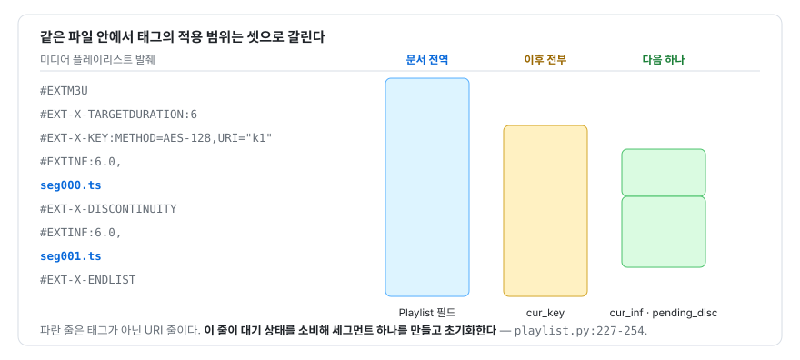

# 부록 B — 규격 원문 대조표

**RFC 8216 의 조항 ↔ 이 저장소의 코드 위치 ↔ 교재의 장**

> 부록 B · 참조용 문서
> 관련: 제2장(HTTP 위에서 스트리밍을 흉내내기) · 제3장(2계층 간접 참조) ·
> 제14장(세그먼트 확장자 위장)

이 부록은 **규격의 한 줄이 코드의 어느 줄이 되었는지**를 찾기 위한 색인이다. 규격을
읽다가 "이건 실제로 어떻게 구현하지"가 궁금할 때, 또는 코드를 읽다가 "이 분기는 규격의
무엇을 지키는 것인가"가 궁금할 때 양방향으로 쓴다.

**이 저장소가 처리하지 않는 태그도 전부 표에 넣고 `미지원` 으로 표시했다.** 무엇을
다루지 않는지가 곧 지원 범위의 정의이기 때문이다. 규격 원문은 인용하지 않고 조항
번호와 요지만 적는다 — 원문은 RFC 8216 을 직접 볼 것.

---

## B.1 이 표를 읽는 법

대조표의 열은 다음과 같다.

| 열 | 뜻 |
|---|---|
| **태그 · 필드** | 규격이 정의한 이름. 공식 표기 그대로 |
| **조항** | RFC 8216 또는 ISO/IEC 규격의 절 번호 |
| **요지** | 그 조항이 무엇을 정하는지 한 줄로 |
| **코드 위치** | 이 저장소에서 그 태그를 처리하는 줄. `미지원` 이면 처리하는 코드가 없다 |
| **장** | 그 개념을 본격적으로 다루는 교재의 장. 해당 장이 없으면 가장 가까운 장 |

> **용어** — **미지원(unsupported)**: 이 부록에서 `미지원` 은 "파서가 그 줄을 인식하지
> 않고 그냥 지나친다"는 뜻이다. 오류를 내지 않고, 경고도 남기지 않는다. 파서가
> 예외를 던지며 거부하는 경우는 `거부` 로 따로 적었다.

코드 위치는 `playlist.py:307-316` 형식이며, 이 교재의 검사기가 실제 파일의 줄 범위와
대조한다.

```bash
python3 tools/check_docs.py docs     # 앵커가 실제 줄을 가리키는지 검사
```

---

## B.2 M3U8 태그 대조표 — RFC 8216 §4.3

파싱 진입점은 하나다(`playlist.py:207-337` `parse`). 마스터 플레이리스트와 미디어
플레이리스트를 같은 함수가 읽고, 어느 쪽인지는 `EXT-X-STREAM-INF` 또는 `EXT-X-MEDIA`
를 만났는지로 사후에 판정한다(`playlist.py:261`, `playlist.py:275`).

### B.2.1 기본 태그 — §4.3.1

| 태그 | 조항 | 요지 | 코드 위치 | 장 |
|---|---|---|---|---|
| `#EXTM3U` | §4.3.1.1 | 파일의 **첫 줄**이어야 한다 | `playlist.py:210-211` | 제2장 |
| `#EXT-X-VERSION` | §4.3.1.2 | 이 플레이리스트가 준수하는 프로토콜 버전. 파일당 하나 | `playlist.py:256-257` | 제3장 |

`#EXTM3U` 검사는 이 파서가 **의도적으로 거부하는 유일한 지점**이다. 나머지 태그는
없어도 파싱이 계속된다(값이 형식에 맞지 않아 변환 함수가 예외를 내는 경우는 별개다 —
§B.4). 첫 줄이 아니면 `ValueError` 가 나고, 그 예외는 `cli.py:139-140` 에서
`_diagnose` 로 넘어가 "무엇이 왔는지"를 사람이 읽을 수 있게 풀어 준다
(`cli.py:57-102` `_diagnose`).

**`EXT-X-VERSION` 은 파싱만 하고 쓰지 않는다.** `Playlist.version`
(`playlist.py:151`)에 값이 담기지만 저장소 전체에서 이 필드를 읽는 코드가 없다.
버전별 기능 제약(§B.6)을 검사하지 않는다는 뜻이며, 이 부록에서 확인한 미사용 필드는
이것 하나다.

### B.2.2 미디어 세그먼트 태그 — §4.3.2

| 태그 | 조항 | 요지 | 코드 위치 | 장 |
|---|---|---|---|---|
| `#EXTINF` | §4.3.2.1 | 바로 다음 세그먼트 **하나**의 길이(초)와 제목 | `playlist.py:292-295` | 제3·21·39장 |
| `#EXT-X-BYTERANGE` | §4.3.2.2 | 다음 세그먼트가 URI 자원의 부분 범위임. 오프셋 생략 시 직전 범위의 다음 바이트 | `playlist.py:327-329` | 제3·6장 |
| `#EXT-X-DISCONTINUITY` | §4.3.2.3 | 다음 세그먼트와 직전 세그먼트 사이의 불연속 | `playlist.py:331-332` | 제21·22장 |
| `#EXT-X-KEY` | §4.3.2.4 | 이후 세그먼트의 복호화 방법·키 URI·IV·KEYFORMAT | `playlist.py:307-316` | 제23·25·26장 |
| `#EXT-X-MAP` | §4.3.2.5 | 초기화 세그먼트의 위치 | `playlist.py:318-325` | 제19·20장 |
| `#EXT-X-PROGRAM-DATE-TIME` | §4.3.2.6 | 세그먼트 첫 샘플의 절대 벽시계 시각 | **미지원** | 제27장 |
| `#EXT-X-DATERANGE` | §4.3.2.7 | 시간 구간에 붙는 메타데이터(SCTE-35 광고 표시 등) | **미지원** | 제22장 |

> **용어** — **초기화 세그먼트(Media Initialization Section)**: fMP4 세그먼트를 디코딩하는 데
> 필요한 머리 부분(`ftyp` + `moov`). 미디어 데이터는 없고 구조 정보만 들어 있으며,
> 모든 세그먼트 앞에 한 번 붙여야 재생이 성립한다(`cli.py:441-442`).

`EXTINF` 의 선언값 합계는 실측 길이와 대조할 기준선이 된다
(`playlist.py:173-175` `declared_duration`). 이 기준선을 실측값으로 바꾸면 검증이
스스로를 통과시키는 함정이 생긴다 — 제38장의 주제다.

### B.2.3 미디어 플레이리스트 태그 — §4.3.3

| 태그 | 조항 | 요지 | 코드 위치 | 장 |
|---|---|---|---|---|
| `#EXT-X-TARGETDURATION` | §4.3.3.1 | 세그먼트 최대 길이(정수 초). 필수 | `playlist.py:297-298` | 제39장 |
| `#EXT-X-MEDIA-SEQUENCE` | §4.3.3.2 | 첫 세그먼트의 미디어 시퀀스 번호. 없으면 0 | `playlist.py:300-302` | 제23장 |
| `#EXT-X-DISCONTINUITY-SEQUENCE` | §4.3.3.3 | 첫 세그먼트의 불연속 시퀀스 번호 | **미지원** | 제29장 |
| `#EXT-X-ENDLIST` | §4.3.3.4 | 더 이상 세그먼트가 추가되지 않는다 | `playlist.py:334-335` | 제2장 |
| `#EXT-X-PLAYLIST-TYPE` | §4.3.3.5 | `EVENT` 또는 `VOD` | `playlist.py:304-305` | 제2장 |
| `#EXT-X-I-FRAMES-ONLY` | §4.3.3.6 | 세그먼트가 I-프레임만 담는다 | **미지원** | 제2장 |

> **용어** — **미디어 시퀀스 번호(Media Sequence Number)**: 플레이리스트 안 세그먼트에
> 붙는 일련번호. 첫 세그먼트 번호를 `EXT-X-MEDIA-SEQUENCE` 가 정하고 이후 1씩 증가한다
> (`playlist.py:248`). AES-128 의 기본 IV 가 이 값에서 나오므로(§B.7) 단순한 순번이
> 아니라 **복호화에 관여하는 값**이다.

`ENDLIST` 의 유무가 LIVE 판정의 유일한 근거다(`playlist.py:163-166` `is_live`).
그리고 그 판정이 `auto` 모드에서 `remux` 로 내려갈지를 가르므로, 제14장에서 본
**LIVE 와 위장 확장자가 겹칠 때만 나타나는 실패 경로**가 여기서 갈린다.

> **용어** — **트릭 플레이(trick play)**: 빨리 감기·되감기처럼 정상 속도가 아닌 재생.
> I-프레임만 모은 별도 렌디션으로 구현하며, 본편 영상이 아니다.

### B.2.4 마스터 플레이리스트 태그 — §4.3.4

| 태그 | 조항 | 요지 | 코드 위치 | 장 |
|---|---|---|---|---|
| `#EXT-X-MEDIA` | §4.3.4.1 | 대체 렌디션 선언(자막·다국어 오디오·내장 캡션) | `playlist.py:273-290` | 제3·29·30장 |
| `#EXT-X-STREAM-INF` | §4.3.4.2 | 화질 후보. **다음 줄**이 그 미디어 플레이리스트 URI | `playlist.py:259-271` | 제2·3장 |
| `#EXT-X-I-FRAME-STREAM-INF` | §4.3.4.3 | I-프레임 전용 렌디션. URI 가 속성으로 들어간다 | **미지원** | 제3장 |
| `#EXT-X-SESSION-DATA` | §4.3.4.4 | 마스터에 실리는 임의 메타데이터 | **미지원** | 제3장 |
| `#EXT-X-SESSION-KEY` | §4.3.4.5 | 키를 미리 받아 두게 하는 선언 | **미지원** | 제23장 |

> **용어** — **렌디션(rendition)**: 같은 프로그램의 **대체 표현**. 한국어 자막과 영어
> 자막, 원어 오디오와 더빙 오디오가 각각 두 렌디션이다. `EXT-X-MEDIA` 로 선언되어
> `GROUP-ID` 로 묶이고 `EXT-X-STREAM-INF` 의 `AUDIO`·`SUBTITLES` 속성이 그 그룹을
> 참조한다(`playlist.py:269-270`). 720p 와 1080p 처럼 **화질만 다른 것은 렌디션이
> 아니라 variant(Variant Stream)** 이며 `EXT-X-STREAM-INF` 로 선언한다(제2장).

`EXT-X-MEDIA` 의 `URI` 는 선택 속성이고, `TYPE=CLOSED-CAPTIONS` 는 아예 가질 수 없다 —
영상 스트림에 실려 오기 때문이다. 이 저장소는 URI 가 없는 트랙을 `is_embedded` 로 갈라
내려받기 대상에서 제외한다(`playlist.py:86-89`).

### B.2.5 미디어·마스터 공통 태그 — §4.3.5

| 태그 | 조항 | 요지 | 코드 위치 | 장 |
|---|---|---|---|---|
| `#EXT-X-INDEPENDENT-SEGMENTS` | §4.3.5.1 | 모든 세그먼트가 독립적으로 디코딩 가능 | **미지원** | 제19장 |
| `#EXT-X-START` | §4.3.5.2 | 재생을 시작할 지점 | **미지원** | 제2장 |

### B.2.6 RFC 8216 에 없는 태그

아래 태그는 **RFC 8216(2017)에 없다.** Apple 의 HLS 2판과 그 개정 초안
(`draft-pantos-hls-rfc8216bis`)에서 들어온 것들로, 저지연 HLS(LL-HLS)와 델타
플레이리스트가 여기 속한다. 전부 미지원이다.

| 태그 | 출처 | 요지 | 이 저장소에서 |
|---|---|---|---|
| `#EXT-X-GAP` | 8216bis | 이 세그먼트는 **의도적으로** 받을 수 없다 | **미지원** — 수신 실패로 집계 |
| `#EXT-X-BITRATE` | 8216bis | 이후 세그먼트의 대략적 비트레이트 | **미지원** |
| `#EXT-X-DEFINE` | 8216bis | 플레이리스트 안에서 쓰는 변수 정의 | **미지원** |
| `#EXT-X-SERVER-CONTROL` | 8216bis | 재적재 주기·블로킹 요청 등 서버 능력 선언 | **미지원** |
| `#EXT-X-PART` · `#EXT-X-PART-INF` | 8216bis | 세그먼트를 더 잘게 나눈 부분 세그먼트 | **미지원** |
| `#EXT-X-PRELOAD-HINT` | 8216bis | 아직 생기지 않은 자원의 선요청 힌트 | **미지원** |
| `#EXT-X-RENDITION-REPORT` | 8216bis | 다른 렌디션의 현재 위치 보고 | **미지원** |
| `#EXT-X-SKIP` | 8216bis | 델타 플레이리스트에서 생략된 세그먼트 수 | **미지원** — §B.4 참조 |
| `#EXT-X-ALLOW-CACHE` | 구 버전 | 캐시 허용 여부. RFC 8216 §4.3 태그 목록에 없다 | **미지원** |

> **용어** — **델타 플레이리스트(Delta Playlist)**: 긴 라이브 플레이리스트에서 앞부분을
> 생략하고 변한 뒷부분만 실어 보내는 축약본. 생략된 구간은 `EXT-X-SKIP` 이 개수로만
> 표시한다.

---

## B.3 태그의 적용 범위 — 파서 상태 기계

표만으로는 드러나지 않는 것이 하나 있다. **태그마다 효력이 미치는 범위가 다르다.**
같은 파일 안에서 어떤 태그는 문서 전체에 적용되고, 어떤 태그는 바로 다음 세그먼트
하나에만 적용되며, 어떤 태그는 다음 같은 태그가 나올 때까지 계속 적용된다.



*그림 B-1 — 태그의 적용 범위 세 가지와 소비 시점*

파서는 이 셋을 서로 다른 변수로 구현한다(`playlist.py:215-221`).

| 범위 | 해당 태그 | 파서의 상태 | 소비 시점 |
|---|---|---|---|
| 문서 전역 | `EXT-X-VERSION` `EXT-X-TARGETDURATION` `EXT-X-MEDIA-SEQUENCE` `EXT-X-PLAYLIST-TYPE` `EXT-X-ENDLIST` `EXT-X-MAP` | `Playlist` 필드에 즉시 대입 | 즉시 |
| 이후 전부 | `EXT-X-KEY` | `cur_key` | 다음 `EXT-X-KEY` 까지 유지 |
| 다음 하나 | `EXTINF` `EXT-X-BYTERANGE` `EXT-X-DISCONTINUITY` | `cur_inf` `cur_range` `pending_disc` | 다음 URI 줄에서 소비 후 초기화 |

세 번째 줄이 이 파서의 핵심이다. **태그가 아닌 줄(`#` 으로 시작하지 않는 줄)이
등장하는 순간 대기 중이던 상태가 한 덩어리로 묶여 `Segment` 하나가 된다**
(`playlist.py:227-254`). 그래서 `EXTINF` 없이 URI 줄만 나오면 그 줄은 조용히 버려진다 —
`cur_inf` 가 `None` 이라 어느 분기에도 걸리지 않기 때문이다.

`EXT-X-BYTERANGE` 는 여기에 **순서 의존성**을 하나 더 얹는다. 오프셋을 생략하면
직전 범위의 끝을 이어받아야 하므로(§4.3.2.2), 파서는 소비 시점에 `prev_range_end` 를
갱신한다(`playlist.py:250-252`).

실제로 그렇게 동작하는지 확인한 결과다. 아래 본문을 `parse` 에 넣었다(선두의
`#EXTM3U` 와 말미의 `#EXT-X-ENDLIST` 는 지면상 생략했다 — 실제 입력에는 있다).

```
#EXT-X-KEY:METHOD=AES-128,URI="k1"
#EXT-X-BYTERANGE:100@0
#EXTINF:6.0,
all.ts
#EXT-X-BYTERANGE:150
#EXTINF:6.0,
all.ts
#EXT-X-KEY:METHOD=NONE
#EXT-X-BYTERANGE:200
#EXTINF:6.0,
all.ts
```

| 세그먼트 | `byterange` (길이, 오프셋) | `key.method` |
|---|---|---|
| 0 | `(100, 0)` | `AES-128` |
| 1 | `(150, 100)` | `AES-128` |
| 2 | `(200, 250)` | `NONE` |

오프셋을 적지 않은 1번과 2번이 각각 100 과 250 을 이어받았고, 키는 두 번째
`EXT-X-KEY` 를 만나기 전까지 유지됐다. **범위가 다른 두 종류의 상태가 한 파서 안에
공존한다**는 것이 이 구조의 요점이다.

이 상태 의존성은 대가를 치른다. 플레이리스트를 부분적으로 읽거나 줄 순서를 바꾸면
`byterange` 가 조용히 틀린 값이 된다. 오류가 아니라 **다른 바이트 범위**가 되므로,
받아진 데이터는 있는데 내용이 어긋난다. 파서의 상태 기계를 명시적으로 그려야 하는
이유가 이것이다.

---

## B.4 미지원 태그를 무시하면 무엇이 달라지는가

먼저 규격이 무엇을 요구하는지부터. RFC 8216 §6.3.1(General Client Responsibilities)은
클라이언트가 **인식하지 못하는 태그와 속성을 무시해야 한다**고 규정한다. 즉 위 표의
`미지원` 은 규격 위반이 아니라 규격이 지시한 동작이다.

실제로 그렇게 동작하는지 측정했다.

| 입력 | 결과 |
|---|---|
| `#EXT-X-GAP` · 존재하지 않는 태그 · `#EXT-X-PROGRAM-DATE-TIME` 을 섞은 플레이리스트 | 정상 파싱 — 세그먼트 1개, `ENDLIST` 인식 |
| 마스터에 `#EXT-X-I-FRAME-STREAM-INF` 를 넣은 플레이리스트 | `variants` 에 들어가지 않음 — 일반 후보만 남음 |
| `#EXT-X-VERSION:x` (정수가 아닌 값) | `ValueError` — `int()` 변환 실패가 그대로 올라감 |
| 선두에 BOM 이 붙은 플레이리스트 | `ValueError: #EXTM3U 헤더가 없다` |

마지막 두 줄이 이 파서가 실패하는 **두 경로**다. 하나는 의도된 거부(`#EXTM3U` 검사)이고
다른 하나는 값 변환 실패다 — `int()` · `float()` · `bytes.fromhex()` 를 감싸는 예외
처리가 파서 안에 없기 때문에 그대로 올라온다. 둘 다 `cli.py:139-140` 과
`cli.py:189-191` 에서 잡혀 `_diagnose` 로 넘어가므로 사용자가 보는 결과는 같다.

무시가 규격상 허용된다는 것과, 무시해도 결과가 같다는 것은 다른 말이다. 태그별로
무엇이 달라지는지 나눠 적는다.

| 무시하는 태그 | 실제로 달라지는 것 | 확인 수준 |
|---|---|---|
| `EXT-X-I-FRAME-STREAM-INF` | **무시가 옳다.** 이 태그는 URI 를 속성으로 갖는데(§4.3.4.3) 파서의 화질 후보 흐름은 "다음 줄이 URI"를 전제한다. 파싱했다면 트릭 플레이 렌디션이 본편 후보에 섞였을 것이다 | 실측 |
| `EXT-X-SESSION-KEY` | 키 선인출을 하지 않을 뿐, 실제 복호화는 `EXT-X-KEY` 가 지배한다. 손실 없음 | 코드 독해 |
| `EXT-X-SESSION-DATA` `EXT-X-INDEPENDENT-SEGMENTS` `EXT-X-START` `EXT-X-BITRATE` | 정보성 선언이다. 이 도구는 항상 플레이리스트 전체를 처음부터 받으므로 영향 없음 | 코드 독해 |
| `EXT-X-PROGRAM-DATE-TIME` | 벽시계 기준 정렬을 할 수 없다. 다만 이 도구의 자막 정렬은 `X-TIMESTAMP-MAP` 을 쓰므로 대체 경로가 있다(제27장) | 코드 독해 |
| `EXT-X-DATERANGE` | 광고 삽입 구간을 구별할 근거가 사라진다. 이 도구는 대신 `EXT-X-DISCONTINUITY` 선언 수와 실측 결손 수를 견주어 "의도된 이음매"를 추정한다(`report.py:309-316`) | 코드 독해 |
| `EXT-X-DISCONTINUITY-SEQUENCE` | VOD 를 한 번에 받는 이 도구의 사용 방식에서는 영향이 없다. 라이브 플레이리스트를 반복 재적재하며 구간을 잇는 구현이라면 필요하다 | 추론 |
| `EXT-X-I-FRAMES-ONLY` | I-프레임 전용 플레이리스트를 일반 미디어 플레이리스트로 읽는다. 마스터 경로로는 도달하지 않지만(위 첫 행), 사용자가 그 URL 을 직접 넘기면 **트릭 플레이 트랙을 본편으로 받아 저장한다** | 추론 |
| `EXT-X-GAP` | 서버가 "여기는 의도적으로 없다"고 선언한 자리를 수신 실패로 집계한다. **정상 송출에 FAIL 을 내는 오탐** | 추론 |
| `EXT-X-SKIP` | 델타 플레이리스트를 받으면 생략된 세그먼트가 목록에서 통째로 빠진다. 오류 없이 **선언 길이 자체가 줄어들어** 기준선이 조용히 축소된다 | 추론 |

마지막 두 줄이 중요하다. 다른 미지원 태그는 "덜 아는" 정도로 끝나지만, `EXT-X-GAP`
과 `EXT-X-SKIP` 은 **검증 결과를 뒤집는다.** 앞은 정상을 실패로, 뒤는 결손을 정상으로
바꾼다. 둘 다 이 저장소가 다루는 VOD 송출에서는 마주칠 일이 드물지만, 마주치면
조용히 틀린다.

그리고 그 사실이 드러나지 않는 구조적 이유가 하나 있다. 파서의 태그 분기는
`if`/`elif` 사슬이고 **`else` 가 없다**(`playlist.py:256-335`). 모르는 태그와 오타 난
태그가 구별되지 않으며, 무시했다는 기록도 남지 않는다. 규격이 요구하는 동작을
지키면서도 관측 가능성을 얻으려면 "인식하지 못한 `#EXT` 줄의 목록"을 리포트에
남기는 방법이 있으나, 현재 구현에는 없다.

---

## B.5 플레이리스트 파일 자체의 규정 — RFC 8216 §4.1

태그가 아니라 **파일**에 걸리는 요구다.

| 요구 | 조항 | 요지 | 코드 위치 |
|---|---|---|---|
| 식별 방법 | §4.1 | 경로가 `.m3u8` 또는 `.m3u` 로 끝나거나, Content-Type 이 `application/vnd.apple.mpegurl` 또는 `audio/mpegurl` | `playlist.py:18-24` `is_playlist_uri` |
| 인코딩 | §4.1 | UTF-8 이어야 하며 **BOM 을 포함해서는 안 된다** | `cli.py:136` · `cli.py:145` (UTF-8 고정 해석) |
| 첫 줄 | §4.3.1.1 | `#EXTM3U` 로 시작해야 한다 | `playlist.py:210-211` |
| 주석 | §4.1 | `#` 으로 시작하고 `#EXT` 가 아닌 줄은 주석 | 분기에 걸리지 않아 자연히 무시 |
| 속성 목록 | §4.2 | `KEY=VALUE` 를 콤마로 구분하되 따옴표 안의 콤마는 구분자가 아니다 | `playlist.py:27` · `playlist.py:41-45` `_parse_attrs` |

이 저장소는 **경로 확장자만으로** 플레이리스트를 식별한다. Content-Type 은 보지
않는다. 제14장에서 본 이유 그대로다 — 응답 헤더는 서버의 자기 신고이고, 위장 송출이
실재한다. 다만 그 결정에는 대가가 있다. 확장자 없는 플레이리스트 URL 은
`is_playlist_uri` 가 거짓을 내므로 자막 트랙 판별(`subtitles.py:138`)과 ffmpeg 인자
선택(`probe.py:79-80`)이 다른 길로 간다. 참고로 §4.3.4.1 은 `EXT-X-MEDIA` 의 `URI` 가
플레이리스트를 가리키도록 규정하지만, **완성된 `.srt` 파일을 그대로 넣는 송출이
실재한다**(`subtitles.py:118-122`). 이 갈래가 존재하는 이유가 그것이다.

BOM 과 선행 주석에 대한 파서의 반응을 측정했다.

| 입력 | 결과 | 규격상 |
|---|---|---|
| 정상 | 파싱 성공 | — |
| 선두에 BOM | `ValueError: #EXTM3U 헤더가 없다` | §4.1 이 BOM 을 금지하므로 **규격 준수** |
| `#EXTM3U` 앞에 주석 한 줄 | `ValueError: #EXTM3U 헤더가 없다` | §4.3.1.1 이 첫 줄을 요구하므로 **규격 준수** |

둘 다 규격을 그대로 지킨 결과다. 그러나 실무에서 BOM 을 붙여 내보내는 서버를
만나면 이 도구는 열지 못한다. **규격 준수와 상호운용성이 갈리는 지점**이며, 어느
쪽을 택할지는 도구의 역할에 달렸다 — 재생기라면 관대함이 옳고, 검증 도구라면
엄격함이 옳다.

---

## B.6 프로토콜 버전 — RFC 8216 §7

§7 은 어떤 기능을 쓰면 `EXT-X-VERSION` 을 얼마 이상으로 선언해야 하는지를 규정한다.
이 저장소가 실제로 다루는 태그에 한정해 옮기면 다음과 같다.

| 최소 버전 | 그 버전을 요구하는 기능 | 이 저장소의 처리 |
|---|---|---|
| 2 | `EXT-X-KEY` 의 `IV` 속성 | 파싱함 (`playlist.py:314`) |
| 3 | `EXTINF` 의 소수점 길이 | 파싱함 (`playlist.py:295`) |
| 4 | `EXT-X-BYTERANGE` · `EXT-X-I-FRAMES-ONLY` | 앞은 파싱, 뒤는 미지원 |
| 5 | `EXT-X-KEY` 의 `KEYFORMAT` · `KEYFORMATVERSIONS` | `KEYFORMAT` 만 파싱 (`playlist.py:315`) |
| 6 | I-프레임 전용이 아닌 미디어 플레이리스트의 `EXT-X-MAP` | 파싱함 (`playlist.py:318-325`) |

**이 표를 코드가 검사하지는 않는다.** §B.2.1 에서 적었듯 `version` 필드는 읽히지
않는다. 따라서 `#EXT-X-VERSION:3` 을 선언하고 `EXT-X-BYTERANGE` 를 쓰는 규격 위반
플레이리스트도 이 파서는 그대로 읽는다. 관대한 쪽으로 틀린 것이며, 재생을 목적으로
하면 합리적이지만 **규격 준수 검증 도구로는 쓸 수 없다**는 뜻이기도 하다.

---

## B.7 암호화 — RFC 8216 §4.3.2.4 · §5

| 항목 | 조항 | 요지 | 코드 위치 | 장 |
|---|---|---|---|---|
| `METHOD` | §4.3.2.4 | `NONE` · `AES-128` · `SAMPLE-AES` 중 하나 | `playlist.py:52` · `playlist.py:57-59` | 제25·26장 |
| `URI` | §4.3.2.4 | 키를 받을 주소. `METHOD=NONE` 이면 없어야 한다 | `playlist.py:313` · `decrypt.py:21-31` `material` | 제23장 |
| `IV` | §4.3.2.4 | 128비트 초기화 벡터. 버전 2 이상 | `playlist.py:314` | 제23장 |
| IV 부재 시 규칙 | §5.2 | `KEYFORMAT=identity` 이고 `IV` 가 없으면 **미디어 시퀀스 번호를 IV 로 쓴다** | `decrypt.py:44` | 제23장 |
| `KEYFORMAT` | §4.3.2.4 | 키의 형식. 기본값 `identity` = 평문 16바이트 키 | `playlist.py:315` · `playlist.py:62-64` `is_supported` | 제25장 |
| 키 파일 구조 | §5.1 | AES-128 키는 **16옥텟 이진 파일** | `decrypt.py:28-29` (길이 검사) | 제25장 |
| 암호 방식 | §6.2.3 | AES-128-CBC, 블록 경계는 PKCS#7 패딩 | `decrypt.py:45-47` | 제23·24장 |
| 패딩 제거 | §6.2.3 | 마지막 블록의 패딩을 걷어낸다 | `decrypt.py:50-58` `_unpad_pkcs7` | 제24장 |

이 표에서 **교재가 가장 길게 다루는 두 줄**을 짚어 둔다.

- **IV 부재 시 규칙(§5.2).** IV 가 예측 가능하다는 것은 사고가 아니라 규격의 설계다.
  왜 그래도 되는지, 언제 문제가 되는지는 제23장이 다룬다.
- **패딩 제거(§6.2.3).** 이 저장소는 패딩이 깨져도 예외를 던지지 않고 원본을 넘긴다
  (`decrypt.py:54-58`). 서버였다면 그 동작이 곧 취약점이지만 검증 도구에서는 옳다 —
  제24장의 주제다.

### 지원하지 않는 것과 그 이유

| 값 | 이 저장소의 반응 | 근거 |
|---|---|---|
| `METHOD=SAMPLE-AES` | **거부** — `NotImplementedError` | 프레임 단위 부분 암호화라 세그먼트 통째 복호화가 성립하지 않는다 (`playlist.py:63`) |
| `KEYFORMAT` 이 `identity` 가 아님 | **거부** — `NotImplementedError` | 상용 보호 시스템의 키는 이 방식으로 얻을 수 없다 (`decrypt.py:36-40`) |
| `KEYFORMATVERSIONS` | **미지원** | `identity` 외를 다루지 않으므로 판단에 쓰이지 않는다 |

거부는 조용한 실패가 아니라 예외이며, 메시지가 대안(`--mode remux`)까지 알려 준다
(`decrypt.py:37-40`). **다룰 수 없는 것을 다룰 수 있는 척하지 않는 것**이 이 경계의
설계 원칙이다.

---

## B.8 MPEG-TS — ISO/IEC 13818-1

세그먼트 페이로드의 규격이다. 이 저장소가 직접 해석하는 것은 **188바이트 패킷 헤더
4바이트뿐**이고, 그보다 안쪽(PES · PSI)은 전부 ffprobe 에 위임한다.

| 필드 | 비트 | 조항 | 요지 | 코드 위치 | 장 |
|---|---|---|---|---|---|
| `sync_byte` | 8 | §2.4.3.3 | 항상 `0x47` | `tsanalyze.py:13` · `tsanalyze.py:89-91` | 제17·19장 |
| `transport_error_indicator` | 1 | §2.4.3.3 | 전송 계층이 표시한 오류 | `tsanalyze.py:93-94` | 제17장 |
| `payload_unit_start_indicator` | 1 | §2.4.3.3 | PES·PSI 의 시작 패킷 | **미지원** | 제17장 |
| `transport_priority` | 1 | §2.4.3.3 | 우선순위 힌트 | **미지원** | 제17장 |
| `PID` | 13 | §2.4.3.3 | 스트림 식별자 | `tsanalyze.py:96-99` | 제17장 |
| `transport_scrambling_control` | 2 | §2.4.3.3 | 0 이 아니면 복호화되지 않은 패킷 | `tsanalyze.py:101-102` | 제17·26장 |
| `adaptation_field_control` | 2 | §2.4.3.3 | 적응 필드·페이로드의 유무 | `tsanalyze.py:104` (페이로드 비트만) | 제17·18장 |
| `continuity_counter` | 4 | §2.4.3.3 | PID 별 0~15 순환 | `tsanalyze.py:105-119` | 제18장 |
| 널 패킷 `PID=0x1FFF` | — | §2.4.3.3 | 대역을 채우는 빈 패킷 | `tsanalyze.py:14` · `tsanalyze.py:97-98` | 제18장 |
| 적응 필드 · PCR | — | §2.4.3.4 | 프로그램 클럭 기준 | **미지원** | 제21장 |
| PES 헤더의 PTS·DTS | 33 | §2.4.3.6 | 90kHz 단위 표시·디코딩 시각 | **미지원** — ffprobe 에 위임 (`probe.py:191-233` `gap_scan`) | 제21·28장 |
| PAT · PMT | — | §2.4.4 | 프로그램 구성표 | **미지원** — PID 수집만 | 제17장 |

`continuity_counter` 에 대한 규격의 예외 둘을 코드가 그대로 반영한다. 페이로드가 없는
패킷은 카운터를 증가시키지 않고(`tsanalyze.py:107-110`), 직전과 같은 값은 규격이
허용한 중복 패킷이다(`tsanalyze.py:115`). **이 두 예외를 모르면 정상 스트림에서
오탐이 쏟아진다.** 검사기의 정확도가 규격 독해의 깊이에 직접 비례하는 사례다.

컨테이너 판별에도 이 규격이 쓰인다. `sniff` 는 선두 바이트가 `0x47` 인지에 더해
**188바이트 뒤에도 `0x47` 인지**를 본다(`tsanalyze.py:20-37` `sniff`). 주기성이
매직 넘버 역할을 하는 것이며, 우연 일치 확률이 1/256 에서 1/65536 으로 떨어진다.

---

## B.9 ISO-BMFF — ISO/IEC 14496-12

fMP4 세그먼트와 완성된 MP4 파일의 규격이다. 이 저장소는 **최상위 박스만** 훑는다.

| 요소 | 조항 | 요지 | 코드 위치 | 장 |
|---|---|---|---|---|
| 박스 머리 | §4.2 | 크기 4바이트 + 타입 4바이트 | `inventory.py:38` · `inventory.py:80-83` | 제20장 |
| `size == 1` | §4.2 | 64비트 `largesize` 가 뒤따른다 | `inventory.py:84-88` | 제20장 |
| `size == 0` | §4.2 | 이 박스가 파일 끝까지 | `inventory.py:89-90` | 제20장 |
| `uuid` 확장 타입 | §4.2 | 16바이트 사용자 정의 타입 | **미지원** — 크기만 보고 건너뛴다 | 제20장 |
| `ftyp` | §4.3 | 파일 브랜드 선언 | `tsanalyze.py:17` | 제20장 |
| `moov` · `mdat` | §8 | 색인과 본문. 둘 다 있어야 완성본 | `inventory.py:98-101` | 제20장 |
| `styp` · `sidx` · `moof` | §8 | fMP4 세그먼트 선두에 오는 박스 | `tsanalyze.py:17` | 제19·20장 |
| `emsg` | ISO/IEC 23009-1 | DASH 이벤트 메시지. 14496-12 가 아니다 | `tsanalyze.py:17` (판별용) | 제20장 |
| 중첩 박스 | §4.2 | 박스 안의 박스(재귀 TLV) | **미지원** — 최상위만 순회 (`inventory.py:67-102` `_isobmff_flaw`) | 제20장 |

이 파서가 `size` 의 두 특수값을 분기하는 이유는 반례가 명확하기 때문이다.
`size == 0` 을 처리하지 않으면 마지막 박스에서 오프셋이 전진하지 않아 **정상 파일을
손상으로 오판**하고, `size == 1` 을 처리하지 않으면 4GB 를 넘는 `mdat` 를 가진 파일이
전부 실패한다. 반대로 `offset + box_size > size` 검사를 빼면 선언된 크기를 그대로
믿게 되어 **정수 오버플로 기반 파서 취약점**의 고전적 형태가 된다
(`inventory.py:92-95`).

본문을 읽지 않는다는 결정도 규격에서 나온다. 박스가 크기를 자기 머리에 담고 있으므로
`mdat` 를 건너뛰는 데 필요한 것은 seek 한 번이다. 파일이 아무리 커도 비용이 박스
수에만 비례한다.

---

## B.10 WebVTT 와 X-TIMESTAMP-MAP — RFC 8216 §3.5

자막 세그먼트의 규격은 W3C WebVTT 가 정의하지만, **HLS 안에서 쓰일 때의 추가 요구는
RFC 8216 §3.5 가 정의한다.** `X-TIMESTAMP-MAP` 이 바로 그 추가 요구이며 W3C 쪽 규격에는
없다.

| 요소 | 조항 | 요지 | 코드 위치 | 장 |
|---|---|---|---|---|
| WebVTT 세그먼트 | RFC 8216 §3.5 | 자막도 영상과 같은 경계로 조각난다 | `tests/run.sh:97-107` (재현용 생성) | 제29장 |
| `X-TIMESTAMP-MAP` | RFC 8216 §3.5 | `LOCAL:<자막 시각>,MPEGTS:<90kHz 클럭>` 대응표 | `subtitles.py:184-218` `timestamp_offset` | 제27장 |
| 90kHz 단위 | RFC 8216 §3.5 | `MPEGTS` 값의 단위는 MPEG-2 시스템 클럭 | `subtitles.py:188` | 제27장 |
| 33비트 범위 | ISO/IEC 13818-1 | PTS 는 부호 없는 33비트. 음수는 무효 | `subtitles.py:208-210` | 제28장 |
| `WEBVTT` 서명 · 큐 타임코드 | W3C WebVTT | 파일 선두 서명과 `-->` 로 잇는 큐 시각 | `subtitles.py:27-29` · `subtitles.py:417-429` `_sniff_format` | 제16장 |
| 조각마다 반복되는 헤더 | RFC 8216 §3.5 | 조각마다 헤더가 붙는다. 이어붙인 뒤의 처리는 규정 밖 | `subtitles.py:169` · `subtitles.py:172-181` `_clean_body` | 제29장 |
| 경계에 걸친 큐의 중복 | RFC 8216 §3.5 | 양쪽 세그먼트에 넣는 것이 허용된다 | `subtitles.py:259-322` `dedupe` | 제29장 |

정렬 오프셋의 식은 규격의 두 값과 영상의 첫 표시 시각으로 유도된다.

```
오프셋(초) = MPEGTS / 90000 − 영상 첫 PTS − LOCAL(초)
```

이 식이 `subtitles.py:218` 한 줄이다. **유도가 어떻게 되는지, 왜 세 항이 필요한지는
제27장이 다룬다.** 그리고 `MPEGTS` 가 음수면 매핑 자체를 버리는 검사
(`subtitles.py:208-210`)가 없으면 자막 전체가 음수 오프셋만큼 밀린다 — 제28장의 반례다.

표의 "조각마다 반복되는 헤더" 행에는 규격의 사각지대가 하나 들어 있다. 조각마다
`WEBVTT` 와 `X-TIMESTAMP-MAP` 줄이 붙는 것은 §3.5 가 요구한 것이 맞다. 그러나 **여러 조각을
이어붙인 뒤 그 줄들을 어떻게 할 것인가**는 어느 규격도 정하지 않는다. ffmpeg 은 그
줄을 직전 큐의 본문으로 흡수하고, 그 결과 `X-TIMESTAMP-MAP=LOCAL:...` 이 화면에 자막으로
표시된다. **규격을 지킨 송출과 규격을 지킨 도구가 만나도 결과가 깨질 수 있다**는 예다.

---

## B.11 지원 범위가 곧 경계다 — 방어자 관점

이 부록의 `미지원` 표시는 결함 목록이 아니라 **위협 모델의 선언**이다. 어떤 코드가
없다는 것은 그 입력이 도달했을 때 무슨 일이 일어나는지 아무도 보증하지 않는다는
뜻이고, 그 사실을 문서로 남기는 것이 방어의 첫 단계다.

| 역할 | 이 표에서 가져갈 것 |
|---|---|
| **파서 구현자** | 모르는 태그를 무시하는 것은 규격의 요구다(§6.3.1). 그러나 **무시했다는 사실은 기록하라.** 조용한 무시와 조용한 오작동은 사후에 구별되지 않는다 |
| **검증 도구 제작자** | 지원 범위를 표로 공개하지 않은 검증 도구의 PASS 는 정보가 아니다. "이 검사로는 못 잡음"과 "무결함"을 독자가 구별할 수 있어야 한다(제34장) |
| **송출 사업자** | 규격 밖 관행(§B.2.6, §B.5 의 완성 자막 파일)은 클라이언트마다 다르게 깨진다. 규격을 지킨 클라이언트가 열지 못하면 그것은 클라이언트의 결함이 아니다 |
| **감사자** | §B.4 의 확인 수준 열에 `추론` 이 붙은 항목은 **아직 검증되지 않은 주장**이다. 실측한 것과 코드만 읽은 것을 표에서 구별하는 것이 이 부록의 형식이다 |

DRM 관련 경계는 §B.7 의 마지막 표가 전부다. `KEYFORMAT` 이 `identity` 가 아닌 키는
코드 레벨에서 거부되며, **이 교재는 그 거부를 우회하는 방법을 다루지 않는다.**
`AES-128` 이 왜 DRM 이 아닌지는 암호학적 위협 모델의 문제로 제25장에서 다룬다.

---

## B.12 이 부록의 한계

정직하게 적어 둔다.

- **ISO/IEC 규격의 절 번호를 원문과 대조하지 못했다.** RFC 8216 은 공개 문서라 조항
  번호와 요지를 원문으로 확인했지만, ISO/IEC 13818-1 과 14496-12 는 그러지 못했다.
  §B.8·§B.9 의 조항 번호는 널리 인용되는 절 구조를 따른 것이며, **필드 이름과 비트
  폭·코드 위치는 정확하되 절 번호는 재확인이 필요하다.**
- **`추론` 으로 표시한 항목은 실행해 보지 않았다.** §B.4 의 `EXT-X-GAP` ·
  `EXT-X-SKIP` · `EXT-X-I-FRAMES-ONLY` · `EXT-X-DISCONTINUITY-SEQUENCE` 영향은 코드
  독해에서 나온 결론이다. 그 태그를 담은 플레이리스트를 실제로 넣어 결과를 관측하지는
  않았다.
- **RFC 8216 의 개정 초안은 조항 번호를 붙이지 않았다.** §B.2.6 의 태그들은 개정 작업
  중인 문서에서 왔고 번호가 바뀔 수 있어 출처만 적었다.
- **속성 단위 대조는 완전하지 않다.** 표는 태그 단위이며, `EXT-X-STREAM-INF` 의
  `AVERAGE-BANDWIDTH` · `HDCP-LEVEL` · `CLOSED-CAPTIONS` 처럼 파싱하지 않는 개별
  속성까지는 열거하지 않았다. 파싱되는 속성은 `playlist.py:259-290` 에서 직접 확인할
  수 있다.
- **이 부록은 코드의 현재 상태를 찍은 사진이다.** 코드가 바뀌면 앵커가 먼저 깨지고,
  `tools/check_docs.py` 가 그것을 알려 준다. 표의 `미지원` 이 여전히 참인지까지는
  검사기가 보증하지 못한다.

---

**관련 부록** — 여기 나온 태그가 든 플레이리스트를 직접 만들어 보려면 부록 A(실습 환경
구축)를 볼 것. 이 저장소 안에서 마스터 플레이리스트와 자막 트랙을 생성하는 자리는
각각 `tests/run.sh:60-65` 와 `tests/run.sh:110-118` 이다. 용어의 정의만 찾는다면
부록 C, 이 코드가 못 하는 일의 목록은 부록 D 를 볼 것.
