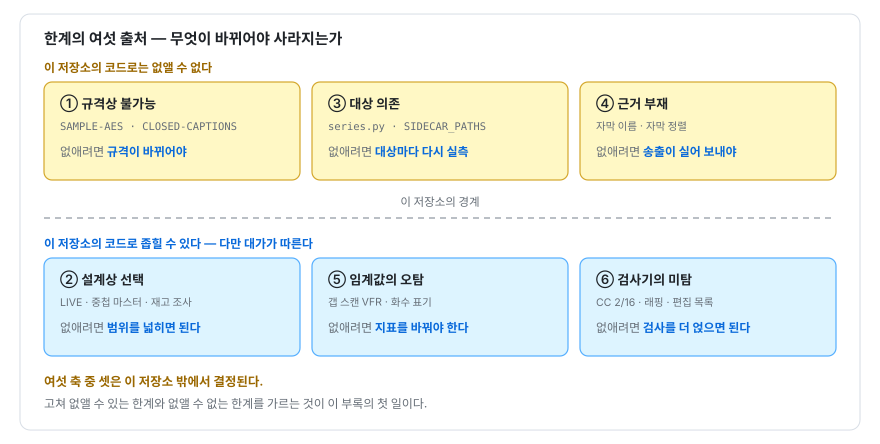

# 부록 D — 이 코드의 알려진 한계

**무엇을 못 하는지 아는 도구가 무엇을 하는지 아는 도구다**

> 부록 · 조회용 문서. 본문 39개 장과 달리 **문제 → 원리 → 코드 → 일반화 → 보안** 5단
> 구성을 따르지 않는다. 아무 절이나 펴서 그 항목만 읽어도 되도록 표와 목록으로 끊어 두었다.

이 부록은 세 물음에 답하는 조회표다.

1. **판정을 읽을 때** — 이 도구가 `PASS` 를 냈다. 그 통과가 **보증하지 않는 것**은 무엇인가.
2. **코드를 고칠 때** — 눈앞의 한계가 코드를 고쳐 없앨 수 있는 것인가, 아닌가.
3. **도구를 고를 때** — 어디까지 이 도구에 맡기고 어디부터 다른 수단이 필요한가.

`README.md:409-441` 의 「알려진 한계」는 11개 항목을 평면으로 나열한다. 이 부록은 그것을
**한계가 어느 원리에서 오는지**로 다시 묶고, 본문 39개 장을 집필하며 새로 드러난 것을
합친다. 항목마다 **"이것을 없애려면 무엇이 필요한가"** 를 한 줄로 붙였다 — 없앨 수 없는
항목에는 없앨 수 없다고 적었다.

---

## D.1 재료 — 두 개의 출처와 세는 법

| 출처 | 위치 | 항목 수 |
|---|---|---|
| README 의 「알려진 한계」 | `README.md:409-441` | 11 |
| 본문 각 장 말미의 「한계와 미해결」 | 제1장 ~ 제39장 | 283 |

뒤의 수는 다음으로 셌다. 재현 가능한 값이다.

```bash
$ cd docs && python3 - <<'PY'
import re, pathlib
n = 0
for p in sorted(pathlib.Path('.').glob('[0-9][0-9]-*.md')):
    m = re.search(r'^## \d+\.\d+ 한계와 미해결\s*$(.*?)(?=^## |\Z)',
                  p.read_text(), re.M | re.S)
    n += len(re.findall(r'^- ', m.group(1), re.M)) if m else 0
print(n)
PY
283
```

283개를 그대로 옮기면 조회표가 아니라 두 번째 교재가 된다. 이 부록은 **README 의 11항목
전부**와, 283항목 중 **README 의 서술을 고치거나 그 목록에 없는 축을 여는 것**을 싣는다.
나머지는 각 장의 「한계와 미해결」 절에 그대로 두었고, 그 절이 원본이다.

---

## D.2 분류 축 — 한계는 어디에서 오는가

> **용어** — **미탐(false negative, 위음성)**: 결함이 있는데 검사가 통과시키는 오류.
> **오탐(false positive, 위양성)**: 결함이 없는데 검사가 실패로 판정하는 오류.

| # | 축 | 뜻 | 없애려면 |
|---|---|---|---|
| ① | **규격상 불가능** | 대상의 구조 자체가 이 처리 방식을 허용하지 않는다 | 규격이 바뀌거나, 다른 계층의 도구를 쓴다 |
| ② | **설계상 선택** | 할 수 있으나 대가를 견주어 하지 않기로 했다 | 범위를 넓힌다. 반대 방향의 대가를 받는다 |
| ③ | **대상 의존** | 실측한 한 대상의 구조에 맞춰져 있다 | 대상마다 다시 실측한다. 항구적 제거는 없다 |
| ④ | **근거 부재** | 필요한 정보가 입력 어디에도 실려 오지 않는다 | 송출이 그 정보를 실어 보내야 한다 |
| ⑤ | **임계값의 오탐** | 연속량에 선을 그은 대가로 정상을 실패로 본다 | 임계가 아니라 **지표**를 바꾼다 |
| ⑥ | **검사기의 미탐** | 검사가 원리적·구현적으로 못 잡는 영역이 있다 | 검사를 더 얹는다. 일부는 정보이론적으로 불가 |

세 축(①③④)은 이 저장소의 코드를 고쳐서는 사라지지 않는다. 나머지 셋(②⑤⑥)은 코드로
좁힐 수 있고, 좁히면 반대 방향의 비용이 온다.



*그림 D-1 — 한계의 여섯 출처와 그것이 결정되는 자리*

이 구분이 실무에서 하는 일은 하나다. **"고치자"는 제안이 성립하는 축과 성립하지 않는
축을 먼저 가른다.** ①③④ 에 대해 "코드를 고치면 된다"고 말하는 순간 그 제안은 근거를
잃는다 — 고칠 코드가 이 저장소에 없기 때문이다.

---

## D.3 ① 규격상 불가능

| 한계 | 근거 | 없애려면 |
|---|---|---|
| `METHOD=SAMPLE-AES` 스트림을 세그먼트 단위로 다루지 못한다 | `playlist.py:61-64` `is_supported` | 세그먼트가 아니라 **샘플** 단위로 복호하는 경로 — 컨테이너·코덱 파서를 직접 갖는 일이다 |
| `KEYFORMAT` 이 `identity` 가 아닌 스트림(Widevine · FairPlay · PlayReady)을 거부한다 | 같은 곳 | **없앨 수 없다.** 키를 발급받은 클라이언트만 재생할 수 있다는 것이 그 방식의 설계 목적이다 |
| `TYPE=CLOSED-CAPTIONS` 캡션을 따로 뽑지 못한다 | `playlist.py:86-89` `is_embedded`, `cli.py:167-169` `closed_captions` | 영상 기본 스트림을 디코드해 캡션 바이트를 꺼내는 코덱 계층 작업. 이 도구의 "재인코딩 없음" 원칙 밖이다 |

> **용어** — **암호화 입자(encryption granularity)**: 암호화가 적용되는 최소 단위.
> HLS 의 `METHOD=AES-128` 은 세그먼트 전체를, `METHOD=SAMPLE-AES` 는 코덱 샘플 단위를
> 대상으로 한다.

> **용어** — **CEA-608/708**: 영상 기본 스트림(elementary stream) 안에 실려 전송되는
> 캡션 규격. 별도 자원이 아니므로 `EXT-X-MEDIA` 선언에 `URI` 속성이 없다.

### D.3.1 SAMPLE-AES — 입자가 처리 구조를 결정한다

거부는 코드 한 줄에 적혀 있다.

```python
# playlist.py:61-64
    @property
    def is_supported(self) -> bool:
        # SAMPLE-AES 는 프레임 단위 부분 암호화라 세그먼트 통째 복호화가 불가능하다.
        return self.method in ("NONE", "AES-128") and self.keyformat == "identity"
```

**이 판정을 하지 않으면 무엇이 깨지는가.** 세그먼트 전체를 AES-128-CBC 로 복호하려 들면
평문으로 남아 있어야 할 컨테이너 헤더까지 함께 변환되어, 결과는 TS 도 SAMPLE-AES 도
아닌 쓰레기가 된다 — **거부하지 않으면 데이터를 파괴한다**(제26장 §26.4.2). 그래서
`auto` 모드는 이 조건에서 세그먼트 경로를 포기하고 ffmpeg 위임으로 내려간다
(`cli.py:391-402` `_decide_mode`). 위임한 쪽의 대가는 다른 모양이다. 제26장이 실측한
거울상 실험에서 관측된 성질은 **컨테이너는 온전하고 샘플만 파괴된다**는 것이다 — 즉
파일은 열리고, 구조 검사도 통과하고, 총 길이도 맞는다. 그 손상을 잡아낸 검사는 전체
디코드 하나뿐이었다(§26.5.3).

### D.3.2 CLOSED-CAPTIONS — 간접의 끝에 주소가 없다

제3장에서 본 2계층 간접 참조의 유일한 예외다. 마스터에 선언은 있는데 그 선언에 주소가
없다. 받을 대상이 없으므로 이 도구는 목록에 표시만 하고 넘어간다.

---

## D.4 ② 설계상 선택

여기 있는 것은 "못 하는 것"이 아니라 **"안 하기로 한 것"** 이다. 항목마다 반대 방향의
대가가 있고, 그 대가를 견주어 고른 결과다.

| 한계 | 근거 | 없애려면 |
|---|---|---|
| LIVE 플레이리스트는 스냅샷 시점까지만 처리한다 | `README.md:414-415`, `cli.py:391-402` `_decide_mode` | 세그먼트 목록을 주기적으로 다시 받아 이어 붙이는 수신 루프 |
| LIVE 에서는 세그먼트 단위 계측을 하지 않는다 | 같은 곳 | 위와 같다. 지금은 ffmpeg 위임이라 TTFB · CC 검사가 통째로 빠진다 |
| variant URL 이 다시 마스터인 중첩 구조를 지원하지 않는다 | `README.md:416` | 마스터 해석을 재귀로 바꾸고 순환 참조 상한을 둔다 |
| 다국어 오디오(`TYPE=AUDIO`)는 목록에 표시만 하고 받지 않는다 | `README.md:417-419` | 오디오 렌디션을 따로 받아 먹싱하는 경로 |
| 재고 조사는 컨테이너 구조만 본다 | `inventory.py:124-160` `flaw` | 구조 검사 뒤에 타임라인 검사를 얹는다. 대가는 회차마다 전체 디코드 |
| `--verify-existing` 도 "열린다"까지만 본다 | `inventory.py:153-159` | 같은 자리에서 `probe.gap_scan` 을 부른다. 지금 보는 것은 `duration <= 0` 뿐이다 |
| 갭 스캔은 산출물에만 돌고 원본 세그먼트에는 돌지 않는다 | `cli.py:616` | 수신 단계에서도 스캔한다. 그래야 송출이 만든 구멍과 재조립이 만든 구멍이 갈린다(제21장) |
| 작품 식별이 애매하면 건너뛰기를 포기한다 | `inventory.py:214-256` `stock_for` | **없앨 필요가 없다.** 의도적 비대칭이다 |

### D.4.1 마지막 항목 — 안전한 실패 방향을 고른 자리

```python
# inventory.py:229-230
    가릴 수 없으면 **빈 재고를 준다.** 잘못 짚어 건너뛰면 회차가 조용히 빠지지만,
    빈 재고는 기존의 파일명 일치 검사로 되돌아갈 뿐이라 손해가 작다.
```

**두 오류의 값이 다르다.** 잘못 건너뛰면 회차 하나가 영원히 빠지고 아무도 모른다. 반대로
헛되게 다시 받으면 요청이 한 번 더 나갈 뿐이고 결과는 옳다. 그래서 애매하면 비싼 쪽이
아니라 싼 쪽으로 실패한다. 이것은 한계로 적혀 있지만 **설계로 읽어야 하는 항목**이다.

### D.4.2 LIVE — 한 선택이 두 가지를 함께 끈다

`_decide_mode` 가 LIVE 에서 `remux` 로 내려가면 세그먼트를 직접 받지 않게 되고, 그러면
세그먼트 단위 계측(요청별 TTFB · SHA-256 · CC 검사)이 전부 사라진다. 즉 README 의 두 줄은
독립된 한계 둘이 아니라 **하나의 결정이 낳은 두 결과**다. 제14장이 지적한
`auto` + 위장 확장자 조합의 재현 곤란한 실패 경로도 여기서 갈라져 나온다.

---

## D.5 ③ 대상 의존

이 축의 항목은 **코드가 틀린 것이 아니라 대상이 바뀌면 틀려지는 것**이다. 고칠 수는
있으나 고침이 끝나지 않는다.

| 한계 | 근거 | 없애려면 |
|---|---|---|
| 시리즈 해석 전체가 실측한 한 사이트의 구조에 맞춰져 있다 | `series.py:1-19`, `README.md:428-430` | 사이트별 어댑터 인터페이스. 저절로 다른 사이트가 되지는 않는다 |
| 재생 소스 발급 XHR 의 형태가 고정돼 있다 | `series.py:266-300` `resolve` | 같음. 발급 절차가 바뀌면 이 함수만 고친다 |
| packed JS 복원기가 패커의 한 변종만 잡는다 | `series.py:224-255` `unpack` | 변종별 규칙 추가 — 끝이 없는 목록이다(제13장) |
| sidecar 자막 경로가 실측한 한 규칙뿐이다 | `subtitles.py:380-395` `SIDECAR_PATHS` | 실측으로 200 을 받은 경로만 추가한다 |
| sidecar 자막의 호스트를 서버가 흘린 허용 origin 에서 얻는다 | 같은 곳, 제10장 | `--sub-origin` · `--referer` 로 사용자가 직접 지정한다 |

모듈 첫머리가 이 의존을 숨기지 않고 목록으로 적어 둔다.

```python
# series.py:13-18
실측한 경로는 다음 넷이며, 사이트가 구조를 바꾸면 여기만 고치면 된다.

    /c/<제목>              시리즈 페이지 — li.list-item 에 회차 번호와 링크
    /e/<제목> N화          회차 페이지  — <iframe> 이 플레이어를 가리킨다
    <플레이어>/video/<해시> 플레이어    — packed JS 안에 정식 파일 이름
    <플레이어>/player/index.php?data=<해시>&do=getVideo  → 서명된 m3u8
```

**이 목록이 없으면 무엇이 깨지는가.** 사이트가 마크업을 바꿨을 때 어디를 고쳐야 하는지
알 수 없다. 의존이 코드 전체에 흩어져 있으면 "이 도구는 왜 갑자기 안 되는가"라는 질문에
답할 자리가 없다. 의존 자체는 없앨 수 없으므로 **의존을 한곳에 모으는 것**이 이 축에서
할 수 있는 최선이다.

### D.5.1 실패가 조용한 지점

제13장이 확인한 것 하나를 옮겨 둔다. packed JS 의 사전 구분자가 다르거나 문자열 조립
방식이 다른 변종을 만나면 복원기는 **빈 문자열을 돌려주고, 코드는 조용히 대체 이름으로
내려간다. 로그도 남지 않는다.** 사용자는 파일 이름이 평소와 다르다는 것으로만 알 수
있다. 대상 의존은 그 자체보다 **의존이 깨졌을 때 소리가 나지 않는 것**이 더 큰 문제다.

sidecar 경로 쪽은 반대로 소리가 나게 해 두었다.

```python
# subtitles.py:392-393
# 앞에서부터 시도하고 첫 성공에서 멈춘다. 규칙이 확인된 사이트를 추가하는 지점 —
# 실측으로 200 을 받은 경로만 둔다. 짐작으로 넣은 경로는 실패할 때마다 헛요청이 된다.
```

---

## D.6 ④ 근거 부재

**정보가 입력 어디에도 없다.** 코드를 아무리 고쳐도 없는 값을 만들어 낼 수는 없으므로,
이 축의 해법은 언제나 "사람이 넣어 주거나 송출이 실어 보내는 것"이다.

| 한계 | 근거 | 없애려면 |
|---|---|---|
| sidecar 자막의 **이름**을 영상 쪽에서 유도할 수 없다 | `subtitles.py:380-395`, `README.md:420-423` | 송출이 자막을 `EXT-X-MEDIA` 로 선언하는 것. 그 전에는 `--sub-name` · `--sub-url` |
| sidecar 자막의 **정렬** 기준이 없다 | `README.md:424-425`, `subtitles.py:191-218` `timestamp_offset` | 자막 쪽에 `X-TIMESTAMP-MAP` 이 실려 오는 것 |
| 갭 스캔 임계 상수 `3.0` · `0.4` 의 출처가 어디에도 기록돼 있지 않다 | `probe.py:191-233` `gap_scan`, 제22장 | 근거를 측정해 주석에 남기는 것 |
| 자막 판정 상수 `5.0` · `-0.5` · 20% 의 근거가 없다 | 제22장 · 제39장 | 같음 |

### D.6.1 앞의 둘과 뒤의 둘은 성격이 다르다

앞의 둘은 **입력에 정보가 없는 것**이고, 뒤의 둘은 **정보가 있었을지도 모르나 기록되지
않은 것**이다. 제22장의 문장을 그대로 옮긴다.

> 없는 것과 기록되지 않은 것은 다르고, 읽는 사람에게는 같다.

자막 URL 을 조립하려면 조각 셋이 필요한데 그중 둘만 얻을 수 있다는 사실이 코드에 적혀
있다.

```python
# subtitles.py:388-390
#   이름     영상 URL 이 불투명 해시라면 어디에서도 유도되지 않는다. 다만 받는 쪽은
#            이미 그 영상의 이름을 알고 있다 — 출력 파일명이 곧 그 이름이다.
#            그래서 기본값을 -o 의 stem 으로 두고, 다르면 --sub-name 으로 덮는다.
```

**대체 근거를 찾은 것**이지 근거를 만들어 낸 것이 아니다. 출력 파일명은 사용자가 정한
값이므로 서버의 이름과 다를 수 있고, 그때는 `--sub-name` 이 유일한 통로가 된다.

정렬 쪽에는 대체 근거가 없다. `X-TIMESTAMP-MAP` 이 없으면 오프셋을 계산할 식 자체가
성립하지 않으므로, 이 코드는 **받은 시각을 그대로 믿고 영상 범위를 벗어나는지만 사후에
확인한다.** 사후 확인은 검출이지 보정이 아니다 — 어긋난 자막을 맞춰 주지는 못한다.

---

## D.7 ⑤ 임계값의 오탐

> **용어** — **VFR(Variable Frame Rate, 가변 프레임률)**: 프레임 간격이 일정하지 않은
> 영상. 프레임 간격의 중앙값을 기준으로 삼는 검사는 여기서 정상 간격을 결손으로 오인할
> 수 있다.

| 한계 | 근거 | 없애려면 |
|---|---|---|
| 갭 스캔이 VFR 소스에서 오탐을 낸다 | `probe.py:224-227`, `README.md:426-427` | 연속량이 아니라 **이산 관측량**으로 표현되는 검사로 바꾼다(제22장) |
| `--no-gap-scan` 으로 끄면 리포트에 흔적이 남지 않는다 | 제21장 · 제22장 | "검사하지 않음" 상태를 판정값으로 추가한다 |
| 이름 끝의 숫자 앞이 또 숫자면 화수로 읽지 않는다 | `naming.py:14-21` | **없앨 수 없다.** 지우면 연도를 화수로 오인하는 반대 오류가 살아난다 |
| 1000화 이상을 화수로 읽지 않는다 | `naming.py:19-21` `EPISODE_RE` | 자릿수 상한을 4로 올린다. 그 순간 연도 오인이 되살아난다 |
| `S01E05` 꼴을 읽지 못한다 | 같은 곳, `README.md:439-441` | 규칙을 하나 더 둔다. 새 규칙은 새 오탐을 들여온다 |

### D.7.1 임계와 규칙은 자리만 고를 수 있다

화수 정규식의 관문은 반례와 함께 적혀 있다.

```python
# naming.py:16-18
# `(?<!\d)` 가 핵심이다. 이것이 없으면 `Sky.Blue.2003` 이 줄기 `Sky.Blue.2` + 화수
# `003` 으로 갈린다 — 연도를 화수로 오인해 영화 한 편이 엉뚱한 시리즈명을 얻는다.
# 화수 앞이 또 숫자라면 그 숫자열은 통째로 하나의 수이지 화수가 아니다.
```

이 관문을 지우면 `Sky.Blue.2003` 이 숫자열 안쪽에서 갈리고, 자릿수 상한 `\d{1,3}` 을
풀면 연도 전체가 화수가 된다 — 상한을 그대로 두면 이번에는 `원피스1000` 이 영화로
분류된다. **자릿수 상한 하나가 두 오류 방향을 동시에 조절한다**(제33장 §33.3.3). 두
방향을 함께 줄이려면 임계가 아니라 지표 — 즉 "이름 끝의 숫자"가 아닌 다른 근거 — 가
필요하다.

### D.7.2 오탐은 지연된 미탐이다

제22장의 결론을 이 부록의 문맥으로 옮긴다. 검증 도구에서 오탐이 잦으면 사용자가 검사를
끄고, 끈 순간 그 검사의 미탐률은 100%가 된다. `--no-gap-scan` 은 그 전환을 **옵션으로
인정한 스위치**다. 그래서 이 축의 항목은 ⑥(검사기의 미탐)과 이어져 있다 — 오탐을 방치하면
미탐으로 옮겨 간다.

---

## D.8 ⑥ 검사기의 미탐

**README 가 이 축을 말하는 항목은 하나뿐이다** — 재고 조사의 온전함 판정
(`README.md:431-435`). 아래 나머지는 전부 본문 각 장에서 나왔다.

| 한계 | 근거 | 없애려면 |
|---|---|---|
| CC 검사의 미탐률은 1/16 이 아니라 **2/16** 이다 | `tsanalyze.py:104-121`, 제18장 | **원리적으로 없앨 수 없다.** 예외를 빼면 미탐이 절반으로 줄지만 오탐이 생긴다 |
| CC 상세가 20건에서 잘린다 | `tsanalyze.py:117`, `tsanalyze.py:68` | 상한을 옵션으로 연다. 총계는 정확하므로 판정에는 영향이 없다 |
| fMP4 세그먼트에는 CC 검사가 없다 | 제18장 | ISO-BMFF 의 전송 무결성 검사를 따로 만든다 |
| `EXT-X-DISCONTINUITY` 를 CC 검사가 참작하지 않는다 | 제18장 | 세그먼트의 불연속 플래그에서 카운터 상태를 비운다 |
| 33비트 PTS 래핑을 다루지 않는다 — 하한만 검사하고 상한이 없다 | `subtitles.py:208-210`, 제28장 | 상한 검사와 구간별 아핀 대응 |
| 구조는 온전한데 내용이 깨진 파일을 걸러내지 못한다 | `README.md:431-435`, `inventory.py:124-160` `flaw` | 구조 검사 뒤에 타임라인 검사(②와 같은 항목의 다른 얼굴) |
| `.mkv` · `.webm` 의 잘림과 `.avi` 의 손상을 잡지 못한다 | 제20장 | 포맷별 구조 검사 추가. `.avi` 는 분기 자체가 없다 |
| 자격증명 편집 목록이 네 개짜리 거부 목록이다 | `report.py:33` `SENSITIVE_HEADERS`, 제12장 | 거부 목록을 **허용 목록으로 뒤집는다**. `--header` 를 받는 한 열거는 완전해지지 않는다 |
| URL 안의 자격증명은 편집 범위 밖이다 | 제12장 | 리포트에 실리는 URL 의 질의 문자열까지 편집 대상에 넣는다 |
| 갭 스캔이 실패하면 항목이 리포트에서 사라진다 | `report.py:304`, 제21장 | `SKIP` 판정값을 만든다(제38장 · 제39장) |
| `target_duration` 이 0 이면 길이 정합에 FAIL 분기가 성립하지 않는다 | `report.py:262-270`, 제39장 | `target_duration` 이 없을 때의 대체 기준을 정한다 |

### D.8.1 CC 검사 — 오탐을 줄인 예외가 미탐을 두 배로 만들었다

```python
# tsanalyze.py:112-118
        prev = last_cc.get(pid)
        if prev is not None:
            expected = (prev + 1) & 0x0F
            if cc != expected and cc != prev:  # cc == prev 는 규격상 허용된 중복 패킷
                rep.cc_discontinuities += 1
                if len(rep.cc_detail) < 20:
                    rep.cc_detail.append((pid, expected, cc))
```

4비트 카운터는 유실 개수 `k` 가 아니라 `k mod 16` 만 관측한다. 여기까지가 정보이론적
한계이고, 커리큘럼은 그 한계를 1/16 으로 적었다(`00-curriculum.md:119`). 그런데 위
`cc != prev` 예외가 잉여류를 하나 더 만들어 **이 구현의 미탐률은 2/16** 이 된다
(제18장 §18.4.2). 예외를 빼면 정상 스트림에서 오탐이 나고, **오탐이 나는 검사기는 아무도
쓰지 않으며, 쓰이지 않는 검사기의 미탐률은 100%다.** 설계는 옳고 대가는 실재한다.

미탐률은 하나의 수가 아니라는 것도 함께 적어 둔다. 제18장 §18.5.1 이 실제 다중화 스트림
하나(`seg000.ts`, 1,142패킷)에서 절단 길이별로 잰 값이다.

| 유실 길이 `L` | 미탐률 |
|---|---|
| 1 · 2 · 4 · 8 · 12 · 14 | 0.4 ~ 0.6% |
| **15 · 16 · 31 · 32 · 47 · 48** | **77 ~ 83%** |
| `L = 1…48` 전체 평균 | 10.76% |

**평균은 어느 쪽 봉우리도 설명하지 못한다.** 위험한 것은 무작위 유실이 아니라 16패킷
배수로 일하는 계층이 만드는 **구조적 유실**이다. 다만 그런 단위를 실제로 쓰는 전송 스택을
관측한 것은 아니며, 이 점은 제18장이 추론이라고 명시했다.

### D.8.2 편집 목록 — 열거는 완전해지지 않는다

```python
# report.py:33
SENSITIVE_HEADERS = frozenset({"cookie", "authorization", "proxy-authorization", "x-api-key"})
```

제12장이 실측한 결과 `X-Auth-Token` · `X-Amz-Security-Token` · `X-Access-Token` ·
`X-CSRF-Token` 등은 편집되지 않는다. 그리고 `--header` 로 임의 헤더를 받는 이상 **목록을
아무리 늘려도 완전해지지 않는다.** 구조를 뒤집어야 한다 — 알려진 것을 가리는 대신, 알려진
것만 남기고 나머지를 전부 가리는 쪽이다.

여기에 제12장이 함께 확인한 사실이 붙는다. `tests/run.sh` 전체를 검색해도
`redact` · `cookie` · `Authorization` 문자열이 한 번도 나오지 않는다. 즉 **이 편집 코드가
망가져도 회귀 테스트는 통과한다.** 제34장의 표현으로 이 검사에는 오라클이 없다.

---

## D.9 README 에 없는 한계 — 집필 중 드러난 것

본문 각 장이 코드를 직접 읽고 실행하면서 나온 항목이다. README 의 11항목에는 없다.

| 한계 | 장 | 축 | 성격 |
|---|---|---|---|
| `ALLOWED_SEGMENT_EXTS` 로 좁힌 변경의 **공격면 축소가 측정되지 않았다** | 제15장 | ④ | 실측 — 뒤 계층에 가려 관측 차이가 0 |
| 자격증명 편집 목록의 불완전성과 URL 미편집 | 제12장 | ⑥ | 실측 |
| 편집 코드에 회귀 테스트가 없다 | 제12장 | ⑥ | 확인 |
| `--sub-embed` 경로에는 중복 제거가 걸리지 않는다(6큐 대 9큐) | 제27장 · 제30장 | ② | 실측 |
| `X-TIMESTAMP-MAP` 이중 적용을 감지하는 검사가 없다 | 제30장 | ⑥ | 코드 독해 |
| 정렬 기준점이 컨테이너 시작 시각과 23.2ms 어긋난다 | 제27장 | ⑥ | 실측 — 계통 오차 |
| `(?<!\d)` 관문을 회귀 테스트가 고정하지 못한다 | 제33장 | ⑥ | 실측 — 픽스처 이름이 관문을 비껴간다 |
| SAMPLE-AES 거부 경로에 회귀 테스트가 없다 | 제26장 | ⑥ | 확인 |
| `--verify-existing` 경로가 테스트로 고정되지 않는다 | 제37장 | ⑥ | 확인 |
| `.avi` 는 구조 검사 분기가 아예 없다 | 제20장 · 제37장 | ⑥ | 실측 |
| 리포트 JSON 의 자막 통계 일부가 덮어써진다 | 제39장 | ⑥ | 코드 독해 |
| 계측 실패가 판정에 반영되지 않는다 | 제39장 | ⑥ | 코드 독해 |
| 수행하지 않은 검사를 표현할 `SKIP` 판정값이 없다 | 제39장 | ⑥ | 확인 |
| 서명 URL 의 `expires` 를 파싱하지 않는다 | 제11장 | ② | 확인 — 구현하지 않은 개선 |

**한 축으로 몰려 있다.** 14항목 중 11개가 ⑥이다. README 의 11항목에서 ⑥이 하나뿐이었던
것과 정확히 반대다. 이유는 단순하다 — **README 는 "이 도구가 무엇을 다루지 않는가"를
적고, 각 장은 "이 검사가 무엇을 못 잡는가"를 적었다.** 앞은 사용자를 향한 범위 선언이고
뒤는 검사기 자신을 향한 감사다. 둘 다 필요하고, **뒤쪽이 README 에 거의 올라오지
않는다는 것 자체가 이 부록이 필요한 이유다.**

---

## D.10 한계 서술이 실측과 어긋난 곳

정직성의 반대편은 거짓이 아니라 **낡은 기록**이다. 두 곳을 찾았다.

### D.10.1 SAMPLE-AES 가 실패하는 이유 — `README.md:411-413`

> **SAMPLE-AES / DRM**: 프레임 단위 부분 암호화나 Widevine·FairPlay 로 보호된
> 스트림은 대상이 아니다. `auto` 모드가 `remux` 로 내리지만 ffmpeg 도 복호화하지
> 못하므로 실패한다.

제26장 §26.5.2 의 실측에서 ffmpeg 8.1.1 은 `METHOD=SAMPLE-AES` 선언을 **거부하지 않고
키를 받아 샘플 단위 복호를 시도했으며 종료 코드 0 으로 끝났다.** `KEYFORMAT` 이 identity
가 아닐 때 실패하는 것은 맞지만, 그 실패의 이유는 "복호화하지 못해서"가 아니라 "키를 받지
못해서"다.

**단정할 수 있는 범위를 지킨다.** 진짜 SAMPLE-AES 스트림과 올바른 키로 확인하기 전까지
README 의 결론이 틀렸다고도 맞다고도 말할 수 없다. 확인된 것은 **근거로 든 이유가 실측과
어긋난다**는 사실까지다.

### D.10.2 CC 미탐률 1/16 — `00-curriculum.md:119`

커리큘럼의 C2 항은 이 한계를 1/16 으로 적었다. 카운터의 정보이론적 한계만 보면 맞지만,
§D.8.1 에서 본 대로 **이 구현의 미탐률은 2/16** 이다. 커리큘럼의 값은 코드를 읽고 원리에서
유도한 것이고, 제18장의 값은 절단 길이를 하나씩 넣어 실제로 세어 본 것이다. **원리에서
유도한 수와 구현을 측정한 수가 다를 수 있다**는 것이 이 어긋남의 교훈이다.

---

## D.11 이 목록 자체의 한계


*그림 D-2 — 알려진 한계 · 적어 둔 한계 · 아직 이름이 없는 것*

- **283항목 중 상당수가 "추론이며 미검증"이라고 스스로 밝히고 있다.** 이 부록은 그 표시를
  지우지 않았다. 실측한 것과 코드 독해로 도출한 것을 §D.9 의 「성격」 열에 나누어 적은 것이
  그 때문이다.
- **실측 수치는 대개 한 환경에서 한 번 잰 값이다.** ffmpeg / ffprobe 8.1.1, macOS arm64,
  Homebrew 빌드. 다른 버전·빌드에서 같은 값이 나온다는 보장은 없다(제30장 §30.10).
- **이 저장소는 ffmpeg 버전을 고정하지 않는다.** 따라서 위임 경로의 동작을 기술한 모든
  항목은 상류가 바뀌면 함께 낡는다.
- **아직 이름이 붙지 않은 한계의 크기는 관측되지 않는다.** 제34장의 오라클 문제가 여기에
  그대로 적용된다 — 이 목록도 결국 **사람이 상상한 목록**이며, 상상하지 못한 실패 모드에
  대해서는 아무 말도 하지 못한다.
- **축의 배당은 이 부록이 사후에 붙인 것이다.** 원 코드에도 README 에도 "이 한계는 어느
  축인가"에 대한 언급이 없다. 항목 하나가 두 축에 걸치는 경우(재고 조사의 온전함 판정 =
  ② + ⑥)가 실제로 있고, 그때는 양쪽에 적었다.

---

## D.12 읽는 법 — 감사자와 방어자를 위한 요약

이 부록의 항목들은 우회 방법의 목록이 아니라 **보증 범위의 경계선**이다. 역할별로 쓰는
방법이 다르다.

| 역할 | 이 부록을 어떻게 쓰는가 |
|---|---|
| **이 도구 사용자** | `PASS` 를 "무결"로 읽지 않는다. **"이 검사들로는 못 잡았다"** 로 읽는다. 특히 fMP4 세그먼트 · LIVE · `--no-gap-scan` 실행에서는 검사 자체가 빠져 있다 |
| **감사자** | 판정을 볼 때 **임계값과 표본 수를 함께 요구한다.** "보안 개선"이라 적힌 변경에는 대조군 측정을 요구한다 — 측정 없는 개선 주장은 검증 대상이지 근거가 아니다(제15장 · 제36장) |
| **코드를 고치는 사람** | 먼저 §D.2 의 축을 정한다. ①③④ 에 대한 "코드를 고치자"는 제안은 성립하지 않는다. ②⑤⑥ 을 고칠 때는 **반대 방향의 대가**를 함께 적는다 |
| **송출·전달 사업자(방어자)** | 상대의 검증 도구가 임계 이하 결손을 보지 못한다는 사실이 곧 **자사 품질 기준의 허점**이다. 통과 = 무결이 아니다(제22장) |
| **검증 도구 설계자** | 오탐을 미탐보다 싼 오류로 다루지 않는다. 오탐이 잦으면 사용자가 검사를 끄고, 그 순간 미탐률이 100%가 된다(제22장 · 제37장) |

### D.12.1 한계를 공개하는 것이 방어자에게 이롭다

이 부록은 "이 도구가 무엇을 놓치는가"를 공개 저장소에 적는다. 감춰야 하는가. 제36장
§36.8.2 의 논지를 그대로 따른다.

- 이 사실들은 대부분 **코드와 상류 도구의 동작에서 누구나 관측할 수 있다.** 감춰도 감춰지지
  않는다.
- 이 사실을 모르는 쪽은 공격자가 아니라 **방어자**다. 아카이브를 운영하면서 자기
  파이프라인이 무엇을 못 보는지 모르는 사람이 위험에 처한다.
- 검사기의 한계를 문서화하는 것은 제18장 · 제25장과 같은 태도다. **"PASS = 무결"이 아니라
  "PASS = 이 검사로는 못 잡음"** 이라는 것을 알아야 그 PASS 를 쓸 수 있다.

---

## D.13 색인 — README 11항목의 배당

원래 목록에서 이 부록의 어느 절로 갔는지의 대조표다.

| # | `README.md:409-441` 의 항목 | 축 | 절 |
|---|---|---|---|
| 1 | SAMPLE-AES / DRM | ① | §D.3 · §D.10.1 |
| 2 | LIVE — 스냅샷 시점까지, 세그먼트 단위 계측 없음 | ② | §D.4 · §D.4.2 |
| 3 | 중첩 마스터 미지원 | ② | §D.4 |
| 4a | 자막 — `TYPE=CLOSED-CAPTIONS` | ① | §D.3 · §D.3.2 |
| 4b | 자막 — 다국어 오디오는 표시만 | ② | §D.4 |
| 5 | sidecar 자막의 이름 | ④ | §D.6 · §D.6.1 |
| 6 | sidecar 자막의 정렬 | ④ | §D.6 · §D.6.1 |
| 7 | 타임라인 갭 임계 | ⑤ | §D.7 |
| 8 | 시리즈 해석은 사이트별 규칙 | ③ | §D.5 |
| 9 | 재고 조사의 온전함 판정 | ② ⑥ | §D.4 · §D.8 |
| 10 | 재고 조사의 작품 식별 | ② | §D.4 · §D.4.1 |
| 11 | 화수 표기 | ⑤ | §D.7 · §D.7.1 |

축별 개수는 ① 2 · ② 5 · ③ 1 · ④ 2 · ⑤ 2 · ⑥ 1 이다(4a·4b·9 를 나누어 센 결과).
**여섯 축을 모두 건드리지만 ⑥ 은 하나뿐**이고, §D.9 에서 본 대로 본문 각 장이 찾아낸
14항목 중 11개가 그 ⑥ 이었다.

---

## D.14 맺음

> **이 도구는 자기가 무엇을 못 하는지 대부분 알고 있고, 그 목록조차 완전하지 않다는 것도
> 알고 있다.**

앞 절반이 이 저장소를 교재로 쓸 수 있게 하는 성질이다. 뒤 절반은 §D.11 을 이 부록에서
뺄 수 없게 만든다 — 한계 목록에 **그 목록 자체의 한계**가 빠져 있으면, 읽는 사람은
목록의 끝을 도구의 끝으로 오해한다. 그 오해가 곧 이 교재가 처음부터 경계한 문장이다.
**"총 길이가 맞는데 중간이 비어 있다."**
