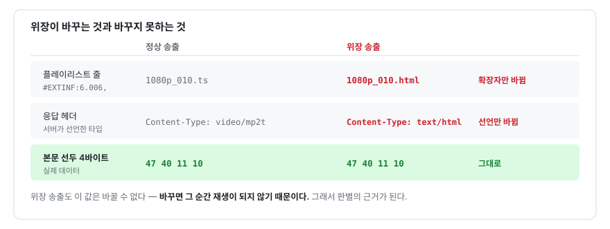
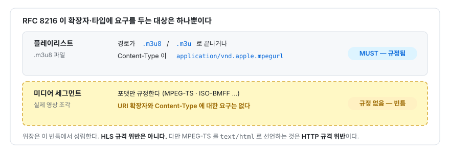
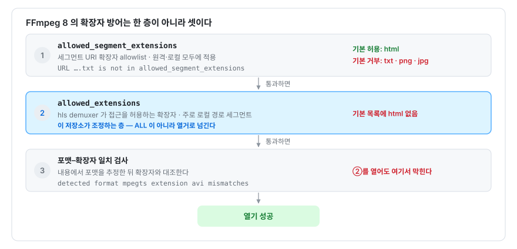
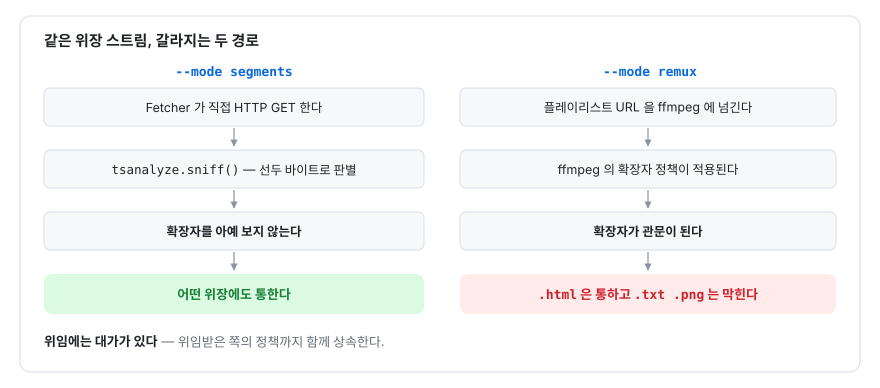

# 조사 보고 01 — 세그먼트 확장자·MIME 위장

**"스트리밍 파일을 HTML 로 보낸다"는 관찰의 검증과 기술 분석**

> 커리큘럼 도입 전 선행 조사. 코드 앵커 · FFmpeg 상류 자료 · 로컬 재현 실험의
> 세 경로로 교차 검증했다. 실험은 `ffmpeg 8.1.1` (macOS, 2026-08-12) 에서 수행.

---

## 1. 결론 요약

| 질문 | 답 |
|---|---|
| 추측이 맞는가 | **맞다.** 단, "HTML 로 보낸다"가 아니라 **"HTML 인 척한다"** 가 정확하다 |
| HTML 이 실제로 쓰이는가 | **아니다.** 파일명 확장자와 `Content-Type` 만 HTML 이고 **본문은 MPEG-TS 바이너리**다 |
| 웹소켓인가 | **아니다.** 순수 HTTP GET 이다. HLS 에는 별도 프로토콜이 없다 |
| 정식 스트리밍 방법인가 | **아니다.** HLS 규격이 금지하지도 요구하지도 않는 **빈틈을 이용한 회피 관행**이다 |
| 얼마나 널리 퍼졌는가 | **FFmpeg 상류가 `.html` 을 세그먼트 허용 목록 기본값에 명시적으로 넣을 정도**로 퍼졌다 |
| 커리큘럼 도입 | **필요.** 독립 장으로 승격 권장 — 근거는 §6 |

---

## 2. 무엇이 실제로 일어나는가

### 2.1 위장의 정체

HLS(HTTP Live Streaming)는 영상을 수 초 단위 **미디어 세그먼트(media segment)** 로
쪼개고, 그 목록을 **미디어 플레이리스트**(`.m3u8` 텍스트 파일)에 적어 내보낸다.
관행적으로 세그먼트는 `.ts`(MPEG-2 Transport Stream) 확장자를 쓴다.

위장 송출은 이 관행만 바꾼다.



*그림 R-1 — 위장이 바꾸는 것과 바꾸지 못하는 것*

`0x47` 은 MPEG-TS 의 **동기 바이트(sync byte)** — 188바이트 패킷마다 선두에 오는
고정값이다. 위장 송출도 이 값은 바꿀 수 없다. 바꾸면 재생이 안 되기 때문이다.

로컬 재현으로 확인한 실물이다.

```
$ xxd -l 4 as_html/seg000.html
00000000: 4740 1110                                G@..
```

**HTML 은 이름만 빌려간 것이고, 파싱되는 HTML 문서는 어디에도 없다.**
따라서 "HTML 이 활용된다"는 표현은 정확하지 않다. 정확한 명칭은
**콘텐츠 타입 위장(content-type masquerading)** 또는 **확장자 위장**이다.

### 2.2 이 저장소가 남긴 실측 기록

이 관행은 추정이 아니라 이 저장소가 이미 실측해 대응한 사안이다.

| 앵커 | 내용 |
|---|---|
| `README.md:242-253` | "확장자 기반 차단을 피하려고 세그먼트를 `1080p_010.html` 처럼 내보내고 `Content-Type: text/html` 로 응답하는 CDN 이 있다" |
| `hlsrecon/probe.py:36-41 (변경 전)` | `-allowed_extensions ALL` 을 넘기는 이유를 주석으로 남김 |
| `hlsrecon/probe.py:48 (변경 전)` | 실제 인자 주입 지점 |
| `hlsrecon/tsanalyze.py:20-37` | 헤더가 아니라 **선두 바이트**로 판별하는 `sniff()` |
| `hlsrecon/cli.py:459-464` | 판별 실패 시 `bogus` 로 기록 — 200 응답이지만 미디어가 아님 |

`README.md:247-250` 이 이 사안의 핵심을 이미 짚어 두었다.

> `text/html` 이라고 선언된 정상 세그먼트를 오류 페이지로 오인하지 않고, 반대로 토큰
> 만료 시 오는 진짜 HTML 오류 페이지는 잡아낸다 — **이 CDN 에서는 둘의 헤더가 완전히
> 같아서 이 방식이 아니면 구분할 수 없다.**

---

## 3. 규격상의 위치 — 왜 "정식"이 아닌가

### 3.1 RFC 8216 은 세그먼트 확장자를 규정하지 않는다

RFC 8216(HTTP Live Streaming)은 **플레이리스트에 대해서만** 식별 요구사항을 MUST 로
둔다. 플레이리스트는 경로가 `.m3u8`/`.m3u` 로 끝나거나 Content-Type 이
`application/vnd.apple.mpegurl` 또는 `audio/mpegurl` 이어야 한다.

**미디어 세그먼트에는 그런 요구가 없다.** 규격이 요구하는 것은 세그먼트의 *포맷*
(MPEG-TS 또는 ISO-BMFF 등)이지 *이름*이나 *선언된 타입*이 아니다.



*그림 R-2 — RFC 8216 이 확장자·타입에 요구를 두는 대상*

따라서 `.html` 확장자 자체는 **HLS 규격 위반이 아니다.**

### 3.2 그러나 HTTP 규격 위반이다

`Content-Type` 헤더는 HTTP 규격상 **전송되는 표현의 실제 미디어 타입**을 나타내야
한다. MPEG-TS 바이트열을 `text/html` 로 선언하는 것은 이 요구를 어긴다.

즉 이 관행은 **HLS 규격의 빈틈(세그먼트 URI 자유)을 이용하면서 HTTP 규격(정확한
Content-Type)을 위반하는** 조합이다. "정식 스트리밍 통신 방법"이라고 부를 근거가
어디에도 없다.

### 3.3 그럼에도 사실상 표준처럼 취급된다

FFmpeg 8.1.1 의 HLS demuxer 기본 허용 목록을 직접 조회한 결과다.

```
$ ffmpeg -h demuxer=hls | grep allowed_segment_extensions
-allowed_segment_extensions <string>  (default "3gp,aac,avi,ac3,eac3,flac,mkv,
  m3u8,m4a,m4s,m4v,mpg,mov,mp2,mp3,mp4,mpeg,mpegts,ogg,ogv,oga,ts,vob,vtt,
  wav,webvtt,cmfv,cmfa,ec3,fmp4,html")
                                  ↑ html 이 기본 허용 목록에 있다
```

비교 대상인 `allowed_extensions` 기본값에는 `html` 이 **없다.** 세그먼트 전용 목록에만
있다. 이는 우연이 아니라 **"세그먼트가 `.html` 로 오는 송출이 실재하므로 재생을 위해
허용해야 한다"는 상류의 판단**이다.

반면 `.txt` 는 배제됐고, FFmpeg 관리자들이 **앞으로도 추가하지 않겠다**고 밝힌 것이
공개 이슈로 확인된다. 즉 상류는 위장 확장자마다 개별 판단을 하고 있다.

---

## 4. 로컬 재현 실험

`ffmpeg` 로 5초짜리 테스트 패턴 HLS 스트림을 만들고, 세그먼트 파일명 확장자만
바꾼 사본을 만들어 열림/거부를 측정했다. 내용은 모든 사본이 동일한 MPEG-TS 다.

### 4.1 확장자별 기본 허용 (원격 HTTP, 옵션 없음)

| 확장자 | 결과 | 거부 사유 |
|---|---|---|
| `.ts` | 열림 | — |
| **`.html`** | **열림** | — (기본 허용 목록에 등재됨) |
| `.txt` | 거부 | `allowed_segment_extensions` |
| `.png` | 거부 | `allowed_segment_extensions` |
| `.jpg` | 거부 | `allowed_segment_extensions` |
| `.aaa` | 거부 | `allowed_segment_extensions` |

`.html` 만 특별 대우를 받는다는 사실이 실측으로 확인된다.

### 4.2 방어층은 하나가 아니라 셋이다

옵션 조합을 바꿔 가며 어느 층에 걸리는지 추적했다.

| 입력 | 옵션 | 결과 | 걸린 층 |
|---|---|---|---|
| `.html` / 로컬 | 없음 | 거부 | ② allowed_extensions |
| `.html` / 로컬 | `-allowed_extensions ALL` | **열림** | — |
| `.html` / 로컬 | `-extension_picky 0` | 거부 | ② |
| `.html` / 원격 | 없음 | **열림** | — |
| `.txt` / 로컬 | `-allowed_extensions ALL` | 거부 | ① 세그먼트 allowlist |
| `.txt` / 로컬 | `-allowed_segment_extensions ALL` | 거부 | ② |
| `.txt` / 원격 | `-allowed_segment_extensions ALL` | 거부 | ③ |
| `.txt` / 원격 | `-allowed_extensions ALL` | 거부 | ① |



*그림 R-3 — FFmpeg 8 의 확장자 방어 3층 구조*

**중요:** 이 저장소가 넘기는 `-allowed_extensions ALL` 은 ②만 해제한다. `.txt`·`.png`
위장은 ①에서 먼저 걸리므로 **이 옵션으로는 열리지 않는다.** FFmpeg 8 에서는 ①·③을
동시에 만족시키는 공식 경로가 사실상 없다.

### 4.3 이 저장소 코드의 실제 반응

`.txt` 위장 스트림을 `hls-recon` 에 그대로 물렸다.

| 모드 | 결과 |
|---|---|
| `--mode segments` | **성공** — 7개 검사 통과 |
| `--mode remux` | **실패** (ffmpeg exit 1) |

이 비대칭이 이 조사에서 가장 값진 발견이다.



*그림 R-4 — 같은 위장 스트림에서 갈라지는 두 경로*

**위임에는 대가가 있다 — 위임받은 쪽의 정책까지 함께 상속한다.**
`assemble.py:1-6` 의 설계 원칙("컨테이너 작업은 전부 ffmpeg 에 위임한다")이 만드는
구체적 귀결이며, 코드나 README 어디에도 아직 기록되지 않은 사실이다.

한편 `auto` 모드(`cli.py:391-402`)는 LIVE 이거나 세그먼트 단위 복호화가 불가능할 때만
`remux` 로 내려간다. 따라서 **VOD + 위장 확장자 조합에서는 문제가 드러나지 않고,
LIVE + 위장 확장자 조합에서만 실패가 나타난다** — 재현이 어려운 종류의 결함이다.

---

## 5. 왜 이렇게 보내는가 — 동기 분석

위장이 겨냥하는 것은 **URL 문자열과 응답 헤더만 보고 판단하는 모든 중간 계층**이다.
동기를 층위별로 정리하면 다음과 같다.

| 층위 | 회피 대상 | 작동 원리 |
|---|---|---|
| **클라이언트 확장** | 광고 차단기·다운로드 확장 | 필터 목록이 `.ts`·`\.m3u8` 같은 URL 패턴을 쓴다. 패턴이 안 맞으면 통과 |
| **기업·학교 프록시** | 콘텐츠 필터, MIME 기반 차단 정책 | "동영상 MIME 차단" 규칙이 `video/*` 를 보는데 `text/html` 은 걸리지 않는다 |
| **네트워크 장비** | DPI(심층 패킷 검사), 트래픽 셰이핑 | 확장자·MIME 으로 트래픽을 분류해 대역을 제한하는 장비를 통과 |
| **자동 수집기** | 소박한 스크래퍼·다운로더 | `.ts` 를 찾아 도는 도구가 아무것도 찾지 못한다 |
| **CDN·과금** | 캐시 정책, 대역 과금 구간 | 일부 CDN 은 MIME 별로 캐시 규칙과 단가가 다르다 |

다섯 층위가 공유하는 전제는 하나다.

> **"파일이 무엇인지는 이름과 선언이 말해 준다."**

위장은 이 전제 하나를 무너뜨려 다섯 층을 한꺼번에 통과한다. 그리고 **그 전제는
원래부터 참이 아니었다** — 이름과 선언은 서버가 자기 신고하는 값이고, 어떤 규격도
그것이 참임을 보증하지 않는다.

---

## 6. 보안 분석 — 왜 이 사안이 커리큘럼에 필요한가

### 6.1 FFmpeg 의 확장자 검사는 보안 패치였다

이 검사가 왜 존재하는지가 이 사안의 정점이다. FFmpeg 상류 패치의 커밋 메시지는
이 검사를 **CVE-2023-6602 대응**으로 명시한다 — "HLS Force TTY Demuxer",
"HLS XBIN Demuxer DoS Amplification".

공격 구조는 이렇다. HLS 플레이리스트의 세그먼트 URI 는 규격상 자유다. 공격자가
플레이리스트에 임의 URI 를 적으면, 그것을 여는 쪽은 **의도치 않은 demuxer 를 열게
된다.** FFmpeg 은 수십 종의 demuxer 를 갖고 있고 그중 일부는 미디어와 무관하다
(TTY, XBIN 등). 확장자 allowlist 는 "HLS 세그먼트로 열릴 수 있는 것"의 범위를
좁혀 이 공격면을 막는다.

### 6.2 그리고 이 코드는 그 방어를 끈다

```python
# probe.py:48 (변경 전)
args += ["-allowed_extensions", "ALL"]
```

이 한 줄은 **CVE-2023-6602 대응 방어 중 한 층(②)을 무조건 해제**한다.
`probe.py:36-41 (변경 전)` 의 주석은 이 옵션이 왜 필요한지는 설명하지만, **그것이 보안 방어를
끄는 행위라는 사실은 기록하지 않는다.**

여기서 교재의 핵심 명제가 도출된다.

> **한쪽의 필터 회피 관행이 다른 쪽의 보안 방어를 끄도록 강요한다.**

위장 송출을 재생하려면 확장자 검사를 꺼야 하고, 확장자 검사를 끄면
CVE-2023-6602 계열 공격면이 열린다. 회피와 방어가 같은 통제 지점을 놓고 다투기
때문에, 한쪽의 승리가 자동으로 다른 쪽의 패배가 된다. **어느 한쪽만 보면 이
구조가 보이지 않는다.**

방어자 관점의 정리는 다음과 같다.

| 관점 | 판단 |
|---|---|
| **송출 사업자** | 필터 회피를 얻고, 자사 콘텐츠를 여는 모든 클라이언트에게 보안 방어를 끄도록 요구하게 된다 |
| **클라이언트 구현자** | `ALL` 대신 **필요한 확장자만 열거**해야 한다. `allowed_extensions=html,ts` 가 `ALL` 보다 엄격하게 안전하다 |
| **네트워크 방어자** | 확장자·MIME 기반 통제는 **통제 지점이 될 수 없다.** 통제하려면 페이로드를 봐야 하고, 그러면 TLS 앞에서 무력해진다 |

### 6.3 `ALL` 대신 열거로 — 이 저장소에 적용 가능한 개선

`-allowed_extensions ALL` 은 필요 이상으로 넓다. 이 도구가 실제로 다루는 세그먼트
확장자는 `.ts`·`.m4s`·`.mp4`·`.vtt` 와 위장 확장자 몇 종뿐이다. 최소 권한 원칙에
따르면 열거가 맞다. (본 조사는 분석까지이며 코드는 수정하지 않았다.)

### 6.4 같은 헤더, 정반대 의미 — 판별의 필연성

이 사안의 마지막 층이자 `tsanalyze.sniff()` 가 존재하는 이유다.
**`HTTP 200` + `Content-Type: text/html` 이 두 가지 정반대를 의미한다.**

| 경우 | 헤더 | 본문 선두 | 실제 의미 |
|---|---|---|---|
| 위장된 정상 세그먼트 | `200` `text/html` | `47 40 11 10` | 정상 — 그대로 처리해야 한다 |
| 토큰 만료 오류 페이지 | `200` `text/html` | `3C 21 44 4F` (`<!DO`) | 실패 — FAIL 로 잡아야 한다 |

헤더가 완전히 동일하므로 **선두 바이트 외에는 구분 근거가 없다.** 이것이
`tsanalyze.py:20-37` 의 `sniff()` 가 상태 코드도 Content-Type 도 보지 않고 오직
바이트만 보는 이유다. 그리고 이 판별을 하지 않는 도구는 오류 페이지를 세그먼트로
저장한 뒤 "전량 수신 성공"을 보고하게 된다 — **검증 도구가 정반대의 결론을 내는
지점**이다.

### 6.5 콘텐츠 스니핑의 양면성

여기서 흥미로운 긴장이 발생한다. 브라우저의 MIME 스니핑은 오랫동안 XSS 벡터였고,
그래서 `X-Content-Type-Options: nosniff` 라는 방어 헤더가 만들어졌다. **"선언을
믿지 말고 내용을 보라"는 원칙이 브라우저에서는 취약점이었다.**

같은 원칙이 이 도구에서는 정확성의 근거다. 차이는 **무엇을 결정하는가**에 있다.

| | 브라우저 | 이 도구 |
|---|---|---|
| 스니핑 결과가 결정하는 것 | **실행 여부** (스크립트로 실행할 것인가) | **분류 여부** (미디어인가 오류인가) |
| 오판의 결과 | 임의 코드 실행 | 검증 판정 오류 |
| 옳은 정책 | 선언을 따른다 (`nosniff`) | 내용을 본다 (`sniff`) |

**스니핑이 미덕인지 취약점인지는 스니핑 결과가 무엇을 결정하느냐가 가른다.**
이 대비는 교재에서 단독으로 다룰 값이 있다.

---

## 7. 커리큘럼 반영안

기존 커리큘럼(`docs/00-curriculum.md`)의 제14장을 **확장·승격**하고, 매트릭스에
항목 넷을 추가한다.

### 7.1 장 구성 변경

| 기존 | 변경 후 |
|---|---|
| 14. 확장자·MIME 기반 통제의 무의미함 | **14. 세그먼트 확장자 위장 — 관행의 해부** (§2·§3·§5) |
| — | **15. 회피가 방어를 끄게 만들 때 — CVE-2023-6602 와 `allowed_extensions ALL`** (§6.1–6.3) *신설* |
| 15. 콘텐츠 스니핑의 양면 | 16. 콘텐츠 스니핑의 양면 — `nosniff` 와 `sniff()` (§6.4–6.5 로 보강) |
| 이하 1장씩 밀림 | 제3부가 16장까지, 전체 **39장** |

제14장에는 §4 의 재현 실험이 그대로 실습 절로 들어간다. 외부 사이트 없이 로컬에서
전 과정이 재현되므로 실습 자료로 적합하다.

### 7.2 매트릭스 추가 항목

| # | 코드 앵커 | 지식 | 보안 함의 |
|---|---|---|---|
| A5′ | `probe.py:48 (변경 전)` | FFmpeg HLS 확장자 방어 3층 구조와 각 층의 적용 범위 | ★ `ALL` 은 CVE-2023-6602 대응 방어를 끈다. 최소 권한 원칙상 열거가 옳다 |
| A7 | `assemble.py:1-6` ↔ `cli.py:391-402` | **위임의 정책 상속** — ffmpeg 에 위임하면 ffmpeg 의 확장자 정책까지 상속한다 | segments 모드는 위장에 내성, remux 모드는 취약. `auto` 가 LIVE 에서만 remux 로 내려가므로 **재현이 어려운 실패 경로**가 생긴다 |
| M1′ | `tsanalyze.py:20-37` | 동일 헤더가 정반대를 의미하는 상황에서 선두 바이트가 유일한 판별 근거 | 판별하지 않는 도구는 오류 페이지를 "수신 성공"으로 집계한다 |
| M5 | `tsanalyze.py:20-37` ↔ `nosniff` | 스니핑의 양면성 — 결과가 **실행**을 결정하면 취약점, **분류**를 결정하면 미덕 | 보안 원칙이 문맥 의존적이라는 것의 교과서적 사례 |

---

## 8. 남은 불확실성

정직하게 적어 둔다.

- **사이트 특정.** 이 저장소는 실측한 사이트가 하나이고(`README.md:428-430`), README 는
  이 관행을 "CDN 이 있다"로만 적고 사이트명을 밝히지 않았다. 관찰된 사이트와 README 가
  기록한 CDN 이 동일하다는 **정황은 강하지만 코드만으로는 단정할 수 없다.**
  확정하려면 실제 응답 헤더를 직접 관측해야 한다.
- **동기의 비중.** §5 의 다섯 층위 중 어느 것이 실제 주된 동기인지는 송출자만 안다.
  다섯 모두 기술적으로 성립하지만 순위는 추정이다.
- **`-allowed_extensions ALL` 의 향후 유효성.** FFmpeg 8 에서 `.html` 이 기본 허용
  목록에 있으므로 현재는 원격 경로에서 이 옵션 없이도 열린다. 상류가 목록에서
  `.html` 을 빼면 동작이 바뀐다. **상류 정책에 의존하는 지점**이다.

---

## 9. 출처

- [RFC 8216 — HTTP Live Streaming (RFC Editor)](https://www.rfc-editor.org/rfc/rfc8216.html)
- [RFC 8216 — datatracker](https://datatracker.ietf.org/doc/html/rfc8216)
- [FFmpeg-devel: avformat/hls — Be more picky on extensions (CVE-2023-6602 언급)](https://ffmpeg.org/pipermail/ffmpeg-devel/2025-January/338453.html)
- [FFmpeg-cvslog: avformat/hls — Be more picky on extensions](https://lists.ffmpeg.org/pipermail/ffmpeg-cvslog/2025-January/147056.html)
- [FFmpeg libavformat/hls.c (소스)](https://github.com/FFmpeg/FFmpeg/blob/master/libavformat/hls.c)
- [Kodi 21.3 + FFmpeg 8 — `.txt` 세그먼트 거부 실사례](https://github.com/team-crew/team-crew.github.io/issues/215)
- [Stremio — PNG 세그먼트 기반 HLS(image-based HLS) 지원 요청](https://github.com/Stremio/stremio-features/issues/1502)
- [HTTP Live Streaming — Wikipedia](https://en.wikipedia.org/wiki/HTTP_Live_Streaming)
- 로컬 재현 실험: `ffmpeg 8.1.1` (macOS, 2026-08-12)
